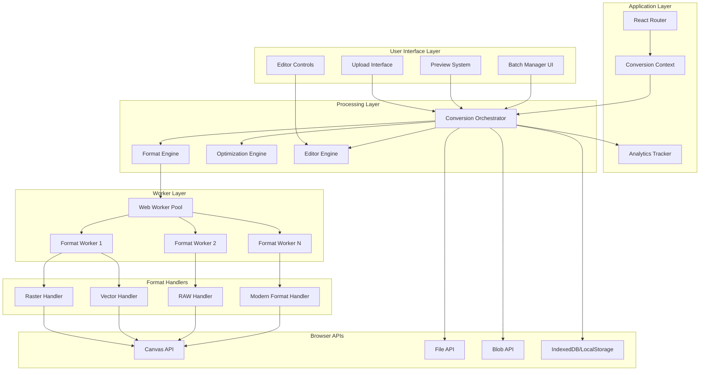

# Design Document: Best-in-Class Image Converter

## Overview

The Best-in-Class Image Converter is a comprehensive, client-side image format conversion system designed to establish ConvertAll Hub as the premier destination for image conversion. The system will support 20+ input formats and 9+ output formats, with advanced features including batch processing (up to 50 images), real-time preview with comparison tools, smart optimization presets, and professional-grade editing controls.

### Key Design Goals

1. **Privacy-First Architecture**: All processing occurs client-side using Web Workers - no server uploads
2. **Superior UX**: Drag-drop, paste, URL import, keyboard shortcuts, and responsive design
3. **Performance**: Sub-2-second conversions for typical images, lazy-loaded format engines, <800KB initial bundle
4. **Comprehensive Format Support**: 20+ input formats including RAW camera formats (CR2, NEF, ARW), modern formats (AVIF, HEIC, HEIF), and legacy formats
5. **Professional Features**: Quality control, resize/crop/rotate, DPI settings, metadata stripping, progressive JPEG
6. **SEO Optimization**: Dedicated landing pages for top 20 conversion pairs with schema markup
7. **Accessibility**: WCAG 2.1 AA compliance with keyboard navigation and screen reader support

### Technology Stack

- **Frontend Framework**: React 18 with TypeScript
- **Build Tool**: Vite with code splitting and lazy loading
- **Image Processing**: Canvas API, Web Workers for non-blocking operations
- **Format Libraries**: 
  - Browser-native for JPG, PNG, GIF, BMP, WEBP
  - AVIF/HEIC polyfills for broader support
  - RAW format parsers (libraw.js or similar)
  - SVG sanitization (DOMPurify)
- **UI Components**: Radix UI primitives with Tailwind CSS
- **State Management**: React Context for conversion state
- **Routing**: React Router for format-specific landing pages

## Architecture

### System Architecture Diagram



### Component Architecture

The system follows a layered architecture with clear separation of concerns:

1. **UI Layer**: React components for user interaction, file upload, preview, and controls
2. **Application Layer**: State management, routing, and analytics
3. **Processing Layer**: Core conversion logic, optimization algorithms, and editing operations
4. **Worker Layer**: Background threads for CPU-intensive image processing
5. **Format Handler Layer**: Specialized handlers for different image format families
6. **Browser API Layer**: Direct interaction with Canvas, File, and Storage APIs

### Data Flow

1. User uploads image(s) via drag-drop, paste, file picker, or URL
2. Upload Handler validates format and size, creates File/Blob objects
3. Conversion Orchestrator queues conversion jobs
4. Format Engine determines appropriate handler based on input/output formats
5. Job dispatched to Web Worker from worker pool
6. Worker loads format-specific handler (lazy-loaded)
7. Handler processes image using Canvas API
8. Optimization Engine applies quality/compression settings
9. Editor Engine applies transformations (resize, crop, rotate)
10. Result returned to main thread
11. Preview System displays comparison
12. User downloads converted image(s)

## Components and Interfaces

### 1. Upload Handler Component

**Responsibility**: Manage all file input methods and initial validation

**Interface**:
```typescript
interface UploadHandlerProps {
  onFilesSelected: (files: File[]) => void
  maxFiles: number
  maxFileSize: number
  supportedFormats: string[]
  isMobile: boolean
}

interface UploadedFile {
  id: string
  file: File
  name: string
  size: number
  detectedFormat: ImageFormat
  thumbnail: string
  status: 'pending' | 'processing' | 'complete' | 'error'
  error?: string
}
```

**Key Features**:
- Drag-and-drop zone with visual feedback
- Clipboard paste detection (Ctrl+V / Cmd+V)
- URL import with CORS handling
- Mobile camera capture
- File format detection via magic bytes (not just extension)
- Thumbnail generation for preview
- Batch upload support (up to 50 files, 20 on mobile)

**Implementation Notes**:
- Use FileReader API for reading file contents
- Detect format by reading file header bytes (magic numbers)
- Generate thumbnails using Canvas API at 200x200px
- Store files in memory (not IndexedDB) for privacy
- Validate file size before processing

### 2. Format Engine Component

**Responsibility**: Convert images between formats using appropriate handlers

**Interface**:
```typescript
interface FormatEngine {
  convert(input: ConversionJob): Promise<ConversionResult>
  getSupportedFormats(): FormatCapabilities
  getRecommendedFormat(image: ImageMetadata): ImageFormat
}

interface ConversionJob {
  id: string
  inputFile: File
  inputFormat: ImageFormat
  outputFormat: ImageFormat
  quality: number
  edits: ImageEdits
  optimizations: OptimizationSettings
}

interface ConversionResult {
  id: string
  blob: Blob
  metadata: ImageMetadata
  processingTime: number
  originalSize: number
  convertedSize: number
  compressionRatio: number
}

interface ImageMetadata {
  width: number
  height: number
  format: ImageFormat
  hasAlpha: boolean
  hasAnimation: boolean
  colorDepth: number
  dpi?: number
  exifData?: Record<string, any>
}

type ImageFormat = 
  | 'jpg' | 'jpeg' | 'png' | 'gif' | 'webp' | 'bmp' 
  | 'tiff' | 'tif' | 'ico' | 'svg' | 'avif' 
  | 'heic' | 'heif' | 'cr2' | 'nef' | 'arw' | 'psd'
```

**Format Handler Strategy**:

1. **Raster Handler** (JPG, PNG, BMP, GIF, WEBP)
   - Use native browser Canvas API
   - Load image into HTMLImageElement
   - Draw to Canvas
   - Export using canvas.toBlob() with format and quality

2. **Vector Handler** (SVG)
   - Parse SVG XML
   - Sanitize using DOMPurify
   - For raster output: render to Canvas using canvg
   - For SVG output: optimize and minify

3. **RAW Handler** (CR2, NEF, ARW)
   - Use libraw.js or raw.js for parsing
   - Apply demosaicing and color correction
   - Convert to standard raster format
   - Lazy-loaded due to large library size

4. **Modern Format Handler** (AVIF, HEIC, HEIF)
   - Use polyfill libraries for browser compatibility
   - Decode to Canvas
   - Encode using native API if available, fallback to polyfill
   - Lazy-loaded

**Format Recommendation Logic**:
- Transparency needed → PNG or WEBP
- Animation → GIF or WEBP
- Photography → JPG or WEBP
- Graphics/logos → PNG or WEBP
- Print → TIFF or PNG (high DPI)
- Web optimization → WEBP (with JPG fallback)

### 3. Batch Processor Component

**Responsibility**: Manage multiple concurrent conversions with progress tracking

**Interface**:
```typescript
interface BatchProcessor {
  addJobs(jobs: ConversionJob[]): void
  start(): void
  pause(): void
  resume(): void
  cancel(jobId: string): void
  getProgress(): BatchProgress
}

interface BatchProgress {
  total: number
  completed: number
  failed: number
  inProgress: number
  pending: number
  estimatedTimeRemaining: number
}

interface BatchSettings {
  concurrentWorkers: number
  sameFormatForAll: boolean
  defaultOutputFormat?: ImageFormat
  bulkDownloadAsZip: boolean
}
```

**Key Features**:
- Worker pool management (2-4 workers based on CPU cores)
- Queue management with priority
- Progress tracking per image and overall
- Pause/resume capability
- Individual and bulk download
- ZIP packaging using JSZip
- Error handling with retry logic

**Implementation Notes**:
- Use `navigator.hardwareConcurrency` to determine worker count
- Process images in parallel using Web Worker pool
- Track progress using shared state
- Generate ZIP file client-side for bulk download
- Handle worker failures gracefully with retry (max 3 attempts)

### 4. Preview System Component

**Responsibility**: Display before/after comparison with zoom and comparison modes

**Interface**:
```typescript
interface PreviewSystemProps {
  original: PreviewImage
  converted: PreviewImage
  comparisonMode: 'side-by-side' | 'slider' | 'overlay'
  zoom: number
  onZoomChange: (zoom: number) => void
}

interface PreviewImage {
  dataUrl: string
  width: number
  height: number
  fileSize: number
  format: ImageFormat
}
```

**Key Features**:
- Side-by-side comparison view
- Slider comparison (drag to reveal)
- Zoom controls (25%, 50%, 100%, 200%, 400%)
- Pan capability when zoomed
- File size comparison
- Quality metrics display
- Synchronized zoom/pan between original and converted

**Implementation Notes**:
- Use Canvas for rendering to support large images
- Implement virtual scrolling for memory efficiency
- Debounce zoom/pan updates (100ms)
- Use CSS transforms for smooth slider animation
- Display loading skeleton during conversion

### 5. Editor Tools Component

**Responsibility**: Provide image editing controls (resize, crop, rotate, quality)

**Interface**:
```typescript
interface EditorTools {
  setQuality(quality: number): void
  resize(options: ResizeOptions): void
  crop(area: CropArea): void
  rotate(degrees: 90 | 180 | 270): void
  flip(direction: 'horizontal' | 'vertical'): void
  setDPI(dpi: number): void
  undo(): void
  redo(): void
}

interface ResizeOptions {
  mode: 'percentage' | 'pixels' | 'preset'
  percentage?: number
  width?: number
  height?: number
  preset?: 'instagram' | 'twitter' | 'email' | 'web'
  maintainAspectRatio: boolean
}

interface CropArea {
  x: number
  y: number
  width: number
  height: number
  aspectRatio?: number
}

interface ImageEdits {
  quality: number
  resize?: ResizeOptions
  crop?: CropArea
  rotation: number
  flipHorizontal: boolean
  flipVertical: boolean
  dpi?: number
}
```

**Preset Dimensions**:
- Instagram: 1080x1080 (1:1)
- Twitter: 1200x675 (16:9)
- Email: 800x600 (4:3)
- Web: 1920x1080 (16:9)

**Key Features**:
- Real-time preview updates (<500ms)
- Undo/redo stack (up to 20 operations)
- Aspect ratio locking
- Preset aspect ratios for crop (16:9, 4:3, 1:1, free)
- Quality slider with visual feedback
- DPI presets (72, 150, 300, 600)
- File size estimation

**Implementation Notes**:
- Apply edits in order: crop → rotate → flip → resize → quality
- Use Canvas transformations for rotate/flip
- Implement undo/redo using command pattern
- Debounce quality slider updates (300ms)
- Calculate file size estimate using compression ratio heuristics

### 6. Optimization Engine Component

**Responsibility**: Apply smart compression and optimization presets

**Interface**:
```typescript
interface OptimizationEngine {
  applyPreset(preset: OptimizationPreset): OptimizationSettings
  optimizeLossless(image: ImageData): Promise<Blob>
  stripMetadata(image: ImageData): ImageData
  createProgressiveJPEG(image: ImageData): Promise<Blob>
}

type OptimizationPreset = 'web' | 'print' | 'email' | 'lossless'

interface OptimizationSettings {
  format: ImageFormat
  quality: number
  maxWidth?: number
  maxHeight?: number
  dpi?: number
  stripMetadata: boolean
  progressive: boolean
}
```

**Preset Configurations**:

1. **Web Preset**:
   - Format: WEBP (fallback to JPG)
   - Quality: 85%
   - Max width: 1920px
   - DPI: 72
   - Strip metadata: true
   - Progressive: true

2. **Print Preset**:
   - Format: PNG or TIFF
   - Quality: 100%
   - No size limit
   - DPI: 300
   - Strip metadata: false
   - Progressive: false

3. **Email Preset**:
   - Format: JPG
   - Quality: 75%
   - Max width: 800px
   - DPI: 72
   - Strip metadata: true
   - Progressive: false

4. **Lossless Preset**:
   - Format: PNG
   - Quality: 100%
   - Original dimensions
   - Original DPI
   - Strip metadata: false
   - Progressive: false

**Implementation Notes**:
- Use Canvas compression quality parameter
- Implement metadata stripping by not copying EXIF data
- Progressive JPEG: encode in multiple scans (requires library)
- Lossless compression: use PNG with maximum compression level

### 7. Landing Page Generator

**Responsibility**: Create SEO-optimized format-specific landing pages

**Interface**:
```typescript
interface LandingPageGenerator {
  generatePage(conversion: ConversionPair): LandingPageContent
  generateSitemap(): string
  generateSchemaMarkup(conversion: ConversionPair): object
}

interface ConversionPair {
  from: ImageFormat
  to: ImageFormat
}

interface LandingPageContent {
  title: string
  metaDescription: string
  h1: string
  introduction: string
  comparisonGuide: string
  useCaseTutorial: string
  faq: Array<{ question: string; answer: string }>
  schemaMarkup: object
  internalLinks: Array<{ text: string; url: string }>
}
```

**Top 20 Conversion Pairs** (by search volume):
1. JPG to PNG
2. PNG to JPG
3. WEBP to JPG
4. WEBP to PNG
5. HEIC to JPG
6. HEIC to PNG
7. PNG to WEBP
8. JPG to WEBP
9. GIF to PNG
10. PNG to GIF
11. BMP to JPG
12. BMP to PNG
13. TIFF to JPG
14. TIFF to PNG
15. ICO to PNG
16. PNG to ICO
17. SVG to PNG
18. AVIF to JPG
19. AVIF to PNG
20. CR2 to JPG

**Schema Markup Types**:
- HowTo schema for conversion tutorials
- SoftwareApplication schema for the tool
- FAQPage schema for common questions

**Implementation Notes**:
- Generate pages at build time using React Router
- Include unique content for each conversion pair
- Add format comparison tables
- Link to related conversions
- Include conversion statistics
- Add trust indicators (conversion count, processing time)

### 8. Web Worker Pool

**Responsibility**: Manage background threads for non-blocking image processing

**Interface**:
```typescript
interface WorkerPool {
  dispatch(job: ConversionJob): Promise<ConversionResult>
  getAvailableWorker(): Worker | null
  terminateAll(): void
}

interface WorkerMessage {
  type: 'convert' | 'progress' | 'complete' | 'error'
  jobId: string
  data?: any
  progress?: number
  error?: string
}
```

**Key Features**:
- Dynamic worker count based on CPU cores (min 2, max 4)
- Job queue with FIFO processing
- Worker reuse for efficiency
- Progress reporting from workers
- Error handling and worker recovery
- Lazy loading of format-specific libraries

**Implementation Notes**:
- Create workers on demand
- Use `postMessage` for communication
- Transfer ArrayBuffer ownership for performance
- Implement timeout for stuck workers (30s)
- Terminate and recreate workers on error

## Data Models

### ConversionState Model

```typescript
interface ConversionState {
  files: UploadedFile[]
  currentFile: string | null
  settings: ConversionSettings
  batchSettings: BatchSettings
  history: EditHistory
  preferences: UserPreferences
}

interface ConversionSettings {
  outputFormat: ImageFormat
  quality: number
  edits: ImageEdits
  optimizations: OptimizationSettings
}

interface EditHistory {
  past: ImageEdits[]
  present: ImageEdits
  future: ImageEdits[]
}

interface UserPreferences {
  theme: 'light' | 'dark'
  defaultFormat: ImageFormat
  defaultQuality: number
  defaultOptimization: OptimizationPreset
  saveDefaults: boolean
}
```

### Format Capabilities Model

```typescript
interface FormatCapabilities {
  formats: Record<ImageFormat, FormatInfo>
  conversionMatrix: Record<ImageFormat, ImageFormat[]>
}

interface FormatInfo {
  name: string
  extensions: string[]
  mimeType: string
  supportsTransparency: boolean
  supportsAnimation: boolean
  supportsLossless: boolean
  supportsLossy: boolean
  maxColorDepth: number
  typicalUseCase: string
  browserSupport: BrowserSupport
}

interface BrowserSupport {
  chrome: string
  firefox: string
  safari: string
  edge: string
}
```

### Analytics Event Model

```typescript
interface AnalyticsEvent {
  eventType: 'conversion' | 'feature_usage' | 'error' | 'performance'
  timestamp: number
  data: ConversionEvent | FeatureEvent | ErrorEvent | PerformanceEvent
}

interface ConversionEvent {
  inputFormat: ImageFormat
  outputFormat: ImageFormat
  fileSize: number
  processingTime: number
  compressionRatio: number
}

interface FeatureEvent {
  feature: string
  action: string
  value?: any
}

interface ErrorEvent {
  errorType: string
  errorMessage: string
  inputFormat?: ImageFormat
  outputFormat?: ImageFormat
}

interface PerformanceEvent {
  metric: string
  value: number
  context?: Record<string, any>
}
```


## Error Handling

### Error Categories

1. **Upload Errors**
   - Unsupported format
   - File too large (>50MB)
   - Corrupted file
   - Network error (URL import)
   - CORS error (URL import)

2. **Conversion Errors**
   - Format conversion not supported
   - Memory exhaustion
   - Worker timeout
   - Decoding failure
   - Encoding failure

3. **Browser Compatibility Errors**
   - Missing Canvas API
   - Missing Web Worker support
   - Missing required format support
   - Insufficient memory

4. **User Input Errors**
   - Invalid crop dimensions
   - Invalid resize dimensions
   - Invalid quality value
   - Invalid DPI value

### Error Handling Strategy

**Upload Errors**:
```typescript
interface UploadError {
  type: 'unsupported_format' | 'file_too_large' | 'corrupted' | 'network' | 'cors'
  file: string
  message: string
  suggestion: string
}
```

- Display inline error message next to failed file
- Suggest alternative formats for unsupported files
- Provide file size limit information
- Offer retry option for network errors
- Explain CORS issues with link to documentation

**Conversion Errors**:
```typescript
interface ConversionError {
  type: 'unsupported_conversion' | 'memory' | 'timeout' | 'decode' | 'encode'
  jobId: string
  inputFormat: ImageFormat
  outputFormat: ImageFormat
  message: string
  recovery: RecoveryAction
}

type RecoveryAction = 
  | { type: 'retry' }
  | { type: 'reduce_size'; maxSize: number }
  | { type: 'alternative_format'; formats: ImageFormat[] }
  | { type: 'contact_support' }
```

- Log detailed error to console for debugging
- Display user-friendly message in UI
- Offer recovery actions based on error type
- For memory errors: suggest reducing image size or batch count
- For timeout errors: offer retry with longer timeout
- For unsupported conversions: suggest alternative output formats

**Browser Compatibility Errors**:
```typescript
interface CompatibilityError {
  type: 'missing_api' | 'unsupported_browser'
  requiredFeature: string
  currentBrowser: string
  supportedBrowsers: string[]
}
```

- Display compatibility notice on page load if APIs missing
- Show supported browser versions
- Provide graceful degradation where possible
- Link to browser update instructions

**Error Recovery Flow**:

1. Catch error at appropriate layer (upload, conversion, worker)
2. Classify error type
3. Log to console with full context
4. Transform to user-friendly message
5. Display in UI with recovery options
6. Track error in analytics (without PII)
7. Offer retry or alternative action

**Error Boundaries**:
- Wrap main app in React Error Boundary
- Wrap each tool component in Error Boundary
- Wrap worker communication in try-catch
- Implement fallback UI for catastrophic errors

### Validation

**File Validation**:
```typescript
function validateFile(file: File): ValidationResult {
  // Check file size
  if (file.size > MAX_FILE_SIZE) {
    return { valid: false, error: 'file_too_large' }
  }
  
  // Detect format from magic bytes
  const format = detectFormat(file)
  if (!isSupportedFormat(format)) {
    return { valid: false, error: 'unsupported_format' }
  }
  
  // Validate file structure
  if (!isValidImageFile(file, format)) {
    return { valid: false, error: 'corrupted' }
  }
  
  return { valid: true }
}
```

**Conversion Validation**:
```typescript
function validateConversion(
  inputFormat: ImageFormat,
  outputFormat: ImageFormat
): ValidationResult {
  const matrix = getConversionMatrix()
  
  if (!matrix[inputFormat]?.includes(outputFormat)) {
    const alternatives = matrix[inputFormat] || []
    return {
      valid: false,
      error: 'unsupported_conversion',
      alternatives
    }
  }
  
  return { valid: true }
}
```

**Edit Validation**:
```typescript
function validateEdits(edits: ImageEdits, image: ImageMetadata): ValidationResult {
  // Validate quality
  if (edits.quality < 1 || edits.quality > 100) {
    return { valid: false, error: 'invalid_quality' }
  }
  
  // Validate resize
  if (edits.resize) {
    if (edits.resize.width && edits.resize.width < 1) {
      return { valid: false, error: 'invalid_width' }
    }
    if (edits.resize.height && edits.resize.height < 1) {
      return { valid: false, error: 'invalid_height' }
    }
  }
  
  // Validate crop
  if (edits.crop) {
    if (edits.crop.x < 0 || edits.crop.y < 0) {
      return { valid: false, error: 'invalid_crop_position' }
    }
    if (edits.crop.x + edits.crop.width > image.width) {
      return { valid: false, error: 'crop_exceeds_bounds' }
    }
    if (edits.crop.y + edits.crop.height > image.height) {
      return { valid: false, error: 'crop_exceeds_bounds' }
    }
  }
  
  return { valid: true }
}
```

## Testing Strategy

### Overview

The testing strategy employs a dual approach combining unit tests for specific examples and edge cases with property-based tests for universal correctness properties. This ensures both concrete bug prevention and general correctness across all inputs.

### Unit Testing

**Scope**: Specific examples, edge cases, integration points, error conditions

**Framework**: Vitest with React Testing Library

**Test Categories**:

1. **Component Tests**
   - Upload Handler: drag-drop, paste, URL import, file validation
   - Preview System: comparison modes, zoom, pan synchronization
   - Editor Tools: quality slider, resize, crop, rotate, flip
   - Batch Processor: queue management, progress tracking, pause/resume

2. **Integration Tests**
   - End-to-end conversion flow
   - Format-specific conversions (JPG→PNG, PNG→WEBP, etc.)
   - Batch processing with mixed formats
   - Error recovery flows

3. **Edge Case Tests**
   - Empty file handling
   - Corrupted file handling
   - Maximum file size (50MB)
   - Minimum dimensions (1x1)
   - Maximum dimensions (10000x10000)
   - Images with no EXIF data
   - Images with malformed EXIF data
   - Animated GIF handling
   - Transparent PNG handling
   - SVG with external resources

4. **Error Condition Tests**
   - Unsupported format upload
   - Unsupported conversion attempt
   - Memory exhaustion simulation
   - Worker timeout simulation
   - Network failure (URL import)
   - CORS error (URL import)

**Example Unit Tests**:

```typescript
describe('Upload Handler', () => {
  it('should accept valid image files', () => {
    const file = createMockFile('test.jpg', 'image/jpeg')
    const result = validateFile(file)
    expect(result.valid).toBe(true)
  })
  
  it('should reject files over 50MB', () => {
    const file = createMockFile('large.jpg', 'image/jpeg', 51 * 1024 * 1024)
    const result = validateFile(file)
    expect(result.valid).toBe(false)
    expect(result.error).toBe('file_too_large')
  })
  
  it('should detect format from magic bytes, not extension', () => {
    const file = createMockFile('fake.txt', 'text/plain', pngMagicBytes)
    const format = detectFormat(file)
    expect(format).toBe('png')
  })
})

describe('Format Engine', () => {
  it('should convert JPG to PNG', async () => {
    const jpgFile = await loadTestImage('test.jpg')
    const result = await formatEngine.convert({
      inputFile: jpgFile,
      inputFormat: 'jpg',
      outputFormat: 'png',
      quality: 100
    })
    expect(result.blob.type).toBe('image/png')
  })
  
  it('should preserve transparency when converting PNG to WEBP', async () => {
    const pngFile = await loadTestImage('transparent.png')
    const result = await formatEngine.convert({
      inputFile: pngFile,
      inputFormat: 'png',
      outputFormat: 'webp',
      quality: 100
    })
    const hasAlpha = await checkAlphaChannel(result.blob)
    expect(hasAlpha).toBe(true)
  })
})
```

### Property-Based Testing

**Scope**: Universal properties that hold for all inputs

**Framework**: fast-check (JavaScript property-based testing library)

**Configuration**: Minimum 100 iterations per property test

**Test Tagging**: Each property test references its design document property
- Format: `// Feature: best-in-class-image-converter, Property {number}: {property_text}`


## Correctness Properties

*A property is a characteristic or behavior that should hold true across all valid executions of a system—essentially, a formal statement about what the system should do. Properties serve as the bridge between human-readable specifications and machine-verifiable correctness guarantees.*

### Acceptance Criteria Testing Prework

Before defining properties, I analyzed each acceptance criterion for testability:

**Requirement 1: Comprehensive Format Support**

1.1. WHEN a user uploads JPG, JPEG, PNG, GIF, WEBP, BMP, TIFF, TIF, ICO, SVG, AVIF, HEIC, HEIF, CR2, NEF, ARW, or PSD format, THE Format_Engine SHALL accept the file for conversion
  Thoughts: This is about validating that all specified formats are accepted. We can test this by generating files of each format and ensuring they're accepted.
  Testable: yes - property

1.2. THE Format_Engine SHALL convert images to JPG, PNG, WEBP, GIF, BMP, TIFF, ICO, SVG, or AVIF output formats
  Thoughts: This is covered by testing the conversion matrix - for any valid input/output pair, conversion should succeed.
  Testable: yes - property

1.3. WHEN a user selects an output format, THE Format_Engine SHALL display format information tooltips explaining optimal use cases
  Thoughts: This is a UI requirement about displaying information, not a functional requirement we can test with properties.
  Testable: no

1.4. WHEN a user uploads an image, THE Format_Engine SHALL recommend optimal output formats based on image characteristics (transparency, animation, color depth)
  Thoughts: This is about recommendation logic. We can test that images with transparency recommend formats supporting transparency, etc.
  Testable: yes - property

1.5. IF an uploaded format is not supported, THEN THE Upload_Handler SHALL display a descriptive error message listing supported formats
  Thoughts: This is an error case - for any unsupported format, we should get an error.
  Testable: yes - property

1.6. THE Format_Engine SHALL preserve image dimensions during format conversion unless explicitly modified
  Thoughts: This is a classic invariant - dimensions should remain constant through conversion.
  Testable: yes - property

1.7. WHEN converting from RAW formats (CR2, NEF, ARW), THE Format_Engine SHALL apply default demosaicing and color correction
  Thoughts: This is about specific processing for RAW formats. We can test that RAW conversions produce valid output.
  Testable: yes - example

**Requirement 2: Batch Processing Capabilities**

2.1. THE Upload_Handler SHALL accept up to 50 image files in a single upload operation
  Thoughts: This is a boundary test - we should accept batches up to 50 files.
  Testable: edge-case

2.2. WHEN multiple images are uploaded, THE Batch_Processor SHALL display a list of all queued images with individual status indicators
  Thoughts: This is a UI display requirement, not a functional property.
  Testable: no

2.3. THE Batch_Processor SHALL allow users to select the same output format for all images with one action
  Thoughts: This is a UI interaction test - applying a format to all should work.
  Testable: yes - example

2.4. THE Batch_Processor SHALL allow users to select different output formats for individual images within a batch
  Thoughts: This is about configuration flexibility, tested by example.
  Testable: yes - example

2.5. WHEN batch conversion starts, THE Batch_Processor SHALL display a progress indicator showing completed, in-progress, and pending conversions
  Thoughts: This is a UI display requirement.
  Testable: no

2.6. THE Batch_Processor SHALL provide pause and resume controls for batch operations
  Thoughts: This is about state management - pausing then resuming should preserve state.
  Testable: yes - property

2.7. WHEN all conversions complete, THE Batch_Processor SHALL offer a bulk download option that packages all converted images into a ZIP file
  Thoughts: This is about ZIP packaging - all converted files should be in the ZIP.
  Testable: yes - property

2.8. THE Batch_Processor SHALL process batch conversions using Web_Worker threads to maintain UI responsiveness
  Thoughts: This is an implementation detail about threading, not a functional property.
  Testable: no

2.9. IF a single image fails conversion in a batch, THEN THE Batch_Processor SHALL continue processing remaining images and report the failure
  Thoughts: This is about error isolation - one failure shouldn't stop others.
  Testable: yes - property

**Requirement 3: Advanced Image Controls**

3.1. THE Editor_Tools SHALL provide a quality slider ranging from 1 to 100 for lossy formats
  Thoughts: This is a UI component requirement, tested by example.
  Testable: yes - example

3.2. WHEN the quality slider changes, THE Preview_System SHALL update the preview within 500ms
  Thoughts: This is a performance requirement, not a correctness property.
  Testable: no

3.3. THE Editor_Tools SHALL provide resize options by percentage (1-500%), exact pixels (width/height), and named presets
  Thoughts: This is about resize functionality - resizing by percentage should produce correct dimensions.
  Testable: yes - property

3.4. THE Editor_Tools SHALL include presets for Instagram (1080x1080), Twitter (1200x675), Email (800x600), and Web (1920x1080)
  Thoughts: This is about specific preset values, tested by examples.
  Testable: yes - example

3.5. THE Editor_Tools SHALL provide a maintain aspect ratio toggle that constrains proportions during resize
  Thoughts: This is an invariant - when aspect ratio is locked, the ratio should remain constant.
  Testable: yes - property

3.6. THE Editor_Tools SHALL provide a crop tool with draggable selection area and preset aspect ratios (16:9, 4:3, 1:1, free)
  Thoughts: This is about crop functionality - cropping should produce the specified dimensions.
  Testable: yes - property

3.7. THE Editor_Tools SHALL provide rotate options (90°, 180°, 270°) and flip options (horizontal, vertical)
  Thoughts: This is about transformations - rotating 360° should be identity (round trip).
  Testable: yes - property

3.8. THE Editor_Tools SHALL provide DPI/resolution control for print-optimized outputs (72, 150, 300, 600 DPI)
  Thoughts: This is about DPI metadata - setting DPI should be reflected in output.
  Testable: yes - property

3.9. WHEN any edit is applied, THE Editor_Tools SHALL update the preview and file size estimate within 500ms
  Thoughts: This is a performance requirement.
  Testable: no

**Requirement 4: Real-time Preview and Comparison**

4.1. THE Preview_System SHALL display a side-by-side comparison of original and converted images
  Thoughts: This is a UI display requirement.
  Testable: no

4.2. THE Preview_System SHALL provide a slider comparison mode where dragging reveals original vs converted portions
  Thoughts: This is a UI interaction requirement.
  Testable: no

4.3. THE Preview_System SHALL provide zoom controls (25%, 50%, 100%, 200%, 400%) that apply to both original and converted previews
  Thoughts: This is a UI feature requirement.
  Testable: no

4.4. THE Preview_System SHALL display file size for both original and converted images
  Thoughts: This is a UI display requirement.
  Testable: no

4.5. THE Preview_System SHALL display quality metrics including dimensions, format, and compression ratio
  Thoughts: This is a UI display requirement.
  Testable: no

4.6. WHEN conversion settings change, THE Preview_System SHALL update the converted preview within 500ms
  Thoughts: This is a performance requirement.
  Testable: no

4.7. THE Preview_System SHALL display estimated download size before conversion completes
  Thoughts: This is a UI display requirement.
  Testable: no

4.8. THE Preview_System SHALL maintain zoom and pan position when switching between comparison modes
  Thoughts: This is about state preservation - zoom/pan should persist across mode changes.
  Testable: yes - property

**Requirement 5: Smart Optimization Presets**

5.1-5.4. THE Optimization_Engine SHALL provide "Web", "Print", "Email", and "Lossless" presets
  Thoughts: These are about preset configurations, tested by examples.
  Testable: yes - example

5.5. THE Optimization_Engine SHALL provide a "Strip Metadata" option that removes EXIF data, location, and camera information
  Thoughts: This is about metadata removal - stripped images should not contain EXIF data.
  Testable: yes - property

5.6. WHERE output format is JPG, THE Optimization_Engine SHALL provide a Progressive JPEG option for incremental loading
  Thoughts: This is about a specific encoding option, tested by example.
  Testable: yes - example

5.7. WHEN a preset is selected, THE Optimization_Engine SHALL apply all preset settings and update the preview within 500ms
  Thoughts: This is a performance requirement.
  Testable: no

5.8. THE Optimization_Engine SHALL display the rationale for each preset's settings in a tooltip
  Thoughts: This is a UI display requirement.
  Testable: no

**Requirement 6: Professional User Experience**

6.1-6.9. Various UX requirements (drag-drop, paste, URL import, keyboard shortcuts, dark mode, undo/redo)
  Thoughts: These are mostly UI interaction requirements, not functional properties. Undo/redo is testable as a round-trip property.
  Testable: 6.6 (undo/redo) - yes - property; others - no or example

**Requirement 7: SEO and Landing Pages**

7.1-7.7. Landing page generation requirements
  Thoughts: These are content generation requirements, not functional properties.
  Testable: no

**Requirement 8: Performance and Technical Requirements**

8.1. THE Image_Converter SHALL process all images client-side without uploading to servers
  Thoughts: This is an architectural requirement, not a testable property.
  Testable: no

8.2-8.9. Various performance and technical requirements
  Thoughts: Most are performance requirements or implementation details, not correctness properties.
  Testable: 8.6 (file size limit) - edge-case; others - no

**Requirement 9: Trust and Credibility Indicators**

9.1-9.6. Display requirements for statistics and trust indicators
  Thoughts: These are UI display requirements.
  Testable: no

**Requirement 10: Monetization Integration**

10.1-10.6. Monetization display requirements
  Thoughts: These are UI display requirements.
  Testable: no

**Requirement 11: Mobile Responsiveness**

11.1-11.7. Responsive design requirements
  Thoughts: These are UI layout and interaction requirements.
  Testable: no

**Requirement 12: Error Handling and Recovery**

12.1-12.7. Error handling requirements
  Thoughts: These are about error messages and recovery, tested by examples.
  Testable: yes - example

**Requirement 13: Accessibility Compliance**

13.1-13.7. Accessibility requirements
  Thoughts: These are UI accessibility requirements, not functional properties.
  Testable: no

**Requirement 14: Parser and Format Validation**

14.1. WHEN an image file is uploaded, THE Format_Engine SHALL parse the file header to detect the actual format regardless of file extension
  Thoughts: This is about format detection - detection should be based on content, not extension.
  Testable: yes - property

14.2. THE Format_Engine SHALL validate image file structure before attempting conversion
  Thoughts: This is about validation - invalid files should be rejected.
  Testable: yes - property

14.3. IF file extension does not match actual format, THEN THE Format_Engine SHALL use the detected format and notify the user
  Thoughts: This is about format mismatch handling, tested by example.
  Testable: yes - example

14.4. THE Format_Engine SHALL implement a Pretty_Printer that formats image metadata into human-readable format information
  Thoughts: This is about formatting metadata for display.
  Testable: no

14.5. FOR ALL valid image files, parsing metadata then formatting then parsing SHALL produce equivalent metadata (round-trip property)
  Thoughts: This is explicitly a round-trip property for metadata parsing.
  Testable: yes - property

14.6. THE Format_Engine SHALL handle images with missing or incomplete metadata without failing conversion
  Thoughts: This is about graceful handling of edge cases.
  Testable: edge-case

14.7. WHEN parsing RAW formats, THE Format_Engine SHALL detect the specific camera manufacturer format (Canon CR2, Nikon NEF, Sony ARW)
  Thoughts: This is about RAW format detection, tested by examples.
  Testable: yes - example

**Requirement 15: Performance Monitoring and Analytics**

15.1-15.7. Analytics tracking requirements
  Thoughts: These are about data collection, not functional properties.
  Testable: no

### Property Reflection

After analyzing all acceptance criteria, I identified the following testable properties. Now I'll review for redundancy:

- **Format acceptance** (1.1) and **conversion matrix** (1.2) can be combined into one property about valid conversions
- **Dimension preservation** (1.6) is a core invariant property
- **Batch failure isolation** (2.9) is a unique property about error handling
- **Pause/resume** (2.6) is about state preservation
- **ZIP packaging** (2.7) ensures all files are included
- **Resize by percentage** (3.3) and **aspect ratio preservation** (3.5) are related but test different things
- **Crop dimensions** (3.6) tests output matches specification
- **Rotation round-trip** (3.7) - rotating 360° should be identity
- **DPI metadata** (3.8) tests metadata preservation
- **Metadata stripping** (5.5) tests metadata removal
- **Undo/redo** (6.6) is a round-trip property
- **Format detection** (14.1) tests content-based detection
- **Metadata round-trip** (14.5) is explicitly specified as a round-trip property

These properties are distinct and non-redundant. Each validates a unique aspect of the system.

### Properties

### Property 1: Valid Format Conversions

*For any* supported input format and any supported output format in the conversion matrix, the Format_Engine should successfully convert the image without errors.

**Validates: Requirements 1.1, 1.2**

### Property 2: Dimension Preservation

*For any* image, when converted to a different format without explicit resize/crop operations, the output dimensions should equal the input dimensions.

**Validates: Requirements 1.6**

### Property 3: Transparency Recommendation

*For any* image with an alpha channel (transparency), the Format_Engine should recommend output formats that support transparency (PNG, WEBP, GIF).

**Validates: Requirements 1.4**

### Property 4: Unsupported Format Rejection

*For any* file with an unsupported format, the Upload_Handler should reject the file and provide an error message listing supported formats.

**Validates: Requirements 1.5**

### Property 5: Batch Failure Isolation

*For any* batch of images where one image fails conversion, all other valid images in the batch should complete conversion successfully.

**Validates: Requirements 2.9**

### Property 6: Batch Pause and Resume

*For any* batch conversion that is paused and then resumed, the final output should be identical to a batch that ran without interruption.

**Validates: Requirements 2.6**

### Property 7: ZIP Package Completeness

*For any* batch of successfully converted images, the generated ZIP file should contain exactly one file for each converted image with the correct filename and format.

**Validates: Requirements 2.7**

### Property 8: Resize by Percentage

*For any* image resized by a percentage P, the output dimensions should equal the input dimensions multiplied by P/100 (within rounding tolerance of ±1 pixel).

**Validates: Requirements 3.3**

### Property 9: Aspect Ratio Preservation

*For any* image resized with "maintain aspect ratio" enabled, the ratio of output width to output height should equal the ratio of input width to input height (within 0.01 tolerance).

**Validates: Requirements 3.5**

### Property 10: Crop Dimensions

*For any* crop operation with specified width W and height H, the output image dimensions should be exactly W × H pixels.

**Validates: Requirements 3.6**

### Property 11: Rotation Identity

*For any* image, rotating by 90° four times consecutively should produce an image identical to the original (360° rotation is identity).

**Validates: Requirements 3.7**

### Property 12: DPI Metadata Preservation

*For any* image with DPI setting D applied, the output image metadata should contain DPI value D.

**Validates: Requirements 3.8**

### Property 13: Zoom State Persistence

*For any* zoom level and pan position, switching between comparison modes (side-by-side, slider, overlay) should preserve the zoom level and pan position.

**Validates: Requirements 4.8**

### Property 14: Metadata Stripping

*For any* image with "Strip Metadata" option enabled, the output image should contain no EXIF data, GPS location, or camera information.

**Validates: Requirements 5.5**

### Property 15: Undo-Redo Round Trip

*For any* sequence of edit operations, applying undo then redo should restore the exact state before the undo.

**Validates: Requirements 6.6**

### Property 16: Format Detection from Content

*For any* image file, format detection should be based on file header (magic bytes) and should correctly identify the format even if the file extension is incorrect or missing.

**Validates: Requirements 14.1**

### Property 17: Invalid File Rejection

*For any* file with corrupted or invalid image structure, the Format_Engine should reject the file before attempting conversion.

**Validates: Requirements 14.2**

### Property 18: Metadata Parse-Format Round Trip

*For any* valid image file, parsing metadata, formatting it to human-readable form, then parsing again should produce equivalent metadata.

**Validates: Requirements 14.5**


**Property Test Implementation Guidelines**:

Each correctness property must be implemented as a property-based test using fast-check with the following structure:

```typescript
import fc from 'fast-check'
import { describe, it, expect } from 'vitest'

// Feature: best-in-class-image-converter, Property 1: Valid Format Conversions
describe('Property 1: Valid Format Conversions', () => {
  it('should convert any supported input format to any supported output format', () => {
    fc.assert(
      fc.property(
        fc.constantFrom(...SUPPORTED_INPUT_FORMATS),
        fc.constantFrom(...SUPPORTED_OUTPUT_FORMATS),
        fc.nat({ max: 5 * 1024 * 1024 }), // file size up to 5MB
        async (inputFormat, outputFormat, fileSize) => {
          // Skip if conversion not in matrix
          if (!conversionMatrix[inputFormat]?.includes(outputFormat)) {
            return true
          }
          
          const testImage = await generateTestImage(inputFormat, fileSize)
          const result = await formatEngine.convert({
            inputFile: testImage,
            inputFormat,
            outputFormat,
            quality: 85
          })
          
          expect(result.blob.type).toContain(outputFormat)
          expect(result.error).toBeUndefined()
        }
      ),
      { numRuns: 100 }
    )
  })
})

// Feature: best-in-class-image-converter, Property 2: Dimension Preservation
describe('Property 2: Dimension Preservation', () => {
  it('should preserve dimensions when converting without resize/crop', () => {
    fc.assert(
      fc.property(
        fc.constantFrom(...SUPPORTED_INPUT_FORMATS),
        fc.constantFrom(...SUPPORTED_OUTPUT_FORMATS),
        fc.integer({ min: 10, max: 2000 }), // width
        fc.integer({ min: 10, max: 2000 }), // height
        async (inputFormat, outputFormat, width, height) => {
          if (!conversionMatrix[inputFormat]?.includes(outputFormat)) {
            return true
          }
          
          const testImage = await generateTestImage(inputFormat, { width, height })
          const result = await formatEngine.convert({
            inputFile: testImage,
            inputFormat,
            outputFormat,
            quality: 100,
            edits: {} // no edits
          })
          
          expect(result.metadata.width).toBe(width)
          expect(result.metadata.height).toBe(height)
        }
      ),
      { numRuns: 100 }
    )
  })
})

// Feature: best-in-class-image-converter, Property 11: Rotation Identity
describe('Property 11: Rotation Identity', () => {
  it('should return to original after rotating 360 degrees', () => {
    fc.assert(
      fc.property(
        fc.constantFrom(...SUPPORTED_INPUT_FORMATS),
        fc.integer({ min: 100, max: 1000 }),
        fc.integer({ min: 100, max: 1000 }),
        async (format, width, height) => {
          const original = await generateTestImage(format, { width, height })
          const originalData = await getImageData(original)
          
          let current = original
          // Rotate 90° four times
          for (let i = 0; i < 4; i++) {
            current = await editorEngine.rotate(current, 90)
          }
          
          const finalData = await getImageData(current)
          expect(areImagesEqual(originalData, finalData)).toBe(true)
        }
      ),
      { numRuns: 100 }
    )
  })
})
```

**Test Data Generators**:

Property-based tests require generators for test data:

```typescript
// Generate test images of various formats
function generateTestImage(
  format: ImageFormat,
  options: { width?: number; height?: number; hasAlpha?: boolean; fileSize?: number }
): Promise<File> {
  // Implementation uses Canvas API to generate synthetic test images
}

// Generate batches of images
const batchGenerator = fc.array(
  fc.record({
    format: fc.constantFrom(...SUPPORTED_INPUT_FORMATS),
    width: fc.integer({ min: 10, max: 2000 }),
    height: fc.integer({ min: 10, max: 2000 }),
    hasAlpha: fc.boolean()
  }),
  { minLength: 1, maxLength: 50 }
)

// Generate edit operations
const editGenerator = fc.record({
  quality: fc.integer({ min: 1, max: 100 }),
  resize: fc.option(fc.record({
    width: fc.integer({ min: 10, max: 5000 }),
    height: fc.integer({ min: 10, max: 5000 }),
    maintainAspectRatio: fc.boolean()
  })),
  crop: fc.option(fc.record({
    x: fc.nat({ max: 1000 }),
    y: fc.nat({ max: 1000 }),
    width: fc.integer({ min: 10, max: 1000 }),
    height: fc.integer({ min: 10, max: 1000 })
  })),
  rotation: fc.constantFrom(0, 90, 180, 270),
  flipHorizontal: fc.boolean(),
  flipVertical: fc.boolean()
})
```

**Coverage Goals**:

- 18 property-based tests (one per correctness property)
- Each test runs minimum 100 iterations
- Unit tests for specific examples and edge cases
- Integration tests for end-to-end workflows
- Target: 80%+ code coverage
- All critical paths covered by both unit and property tests

**Test Execution**:

```bash
# Run all tests
npm test

# Run only property-based tests
npm test -- --grep "Property [0-9]+:"

# Run with coverage
npm test -- --coverage

# Run specific property test
npm test -- --grep "Property 1: Valid Format Conversions"
```

**Performance Testing**:

While not part of correctness properties, performance tests should verify:
- Conversion time < 2s for images under 5MB
- Initial bundle size < 800KB
- Time to interactive < 3s
- Memory usage stays under 500MB for batch processing

These are measured separately using performance profiling tools, not property-based testing.

