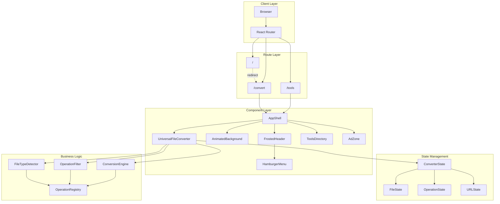

# Design Document: Unified Converter Interface

## Overview

The Unified Converter Interface represents a fundamental architectural transformation of ConvertAll Hub from a tool-grid model to a single, premium workspace model. This design eliminates separate tool pages for file conversions and consolidates ALL file conversion operations (images, audio, video, documents, archives) into a single `/convert` route with a 5-state workflow.

### Design Philosophy

This design is guided by five core principles:

1. **Single Workspace Paradigm**: All file conversions occur in one place (`/convert`), never fragmenting into separate tool pages
2. **State-Driven Interaction**: A clear 5-state progression (Empty → File Loaded → Operation Configured → Converting → Result) that guides users through conversion
3. **Clean Workspace Visual Language**: Light neutral background with subtle animation, prioritizing utility and trust over dramatic effects
4. **Mobile-First Architecture**: Designed for 375px baseline with responsive scaling, not desktop-down adaptation
5. **Performance-First Implementation**: CSS-based animations, minimal JavaScript, GPU acceleration, and lazy loading

### Key Architectural Constraints

These constraints are IMMUTABLE and must be enforced at all levels:

- **NO separate tool pages for file conversions** (no `/image/png-to-jpg`, `/video/mp4-to-mp3`, etc.)
- **ALLOW thin SEO entry routes** (e.g., `/png-to-jpg`) that immediately redirect to `/convert?op=...`
- **NO tool grids for file conversion operations**
- **NO category pages for file conversions** (no `/image`, `/video`, `/audio` pages)
- **ALL file conversions MUST occur at `/convert`**
- **Deep linking MUST use query parameters** (e.g., `/convert?op=png-to-jpg`)
- **Tools directory (`/tools`) is ONLY for calculators and utilities** (no file processing)
- **AdZone MUST always render** (never conditionally mount/unmount to prevent CLS)

### Success Metrics

The design will be considered successful when:

- Lighthouse mobile performance score > 90
- First Contentful Paint < 1.5s on 3G
- Cumulative Layout Shift < 0.1 (enforced AdZone rendering)
- All file conversions accessible from single `/convert` route
- SEO entry routes properly canonicalize to `/convert?op=...`
- Zero tool pages created for file conversion operations
- User can complete any conversion in < 30 seconds
- Mobile touch targets meet 44x44px minimum
- WCAG 2.1 AA compliance achieved

## Architecture

### System Architecture Diagram



### Routing Architecture

The routing system enforces the single-workspace paradigm while allowing SEO-friendly entry routes:

```typescript
// Route Configuration
const routes = {
  root: {
    path: '/',
    redirect: '/convert',
    permanent: true
  },
  convert: {
    path: '/convert',
    component: 'ConverterWorkspace',
    queryParams: ['op', 'file'],
    children: [] // NO child routes allowed
  },
  // SEO Entry Routes (thin pages that redirect to /convert)
  seoEntryRoutes: [
    {
      path: '/png-to-jpg',
      redirect: '/convert?op=png-to-jpg',
      seoShell: true, // Render minimal static shell for prerendering
      canonical: '/convert?op=png-to-jpg',
      meta: {
        title: 'PNG to JPG Converter - Free Online Tool',
        description: 'Convert PNG images to JPG format instantly...'
      }
    },
    {
      path: '/mp4-to-mp3',
      redirect: '/convert?op=mp4-to-mp3',
      seoShell: true,
      canonical: '/convert?op=mp4-to-mp3',
      meta: {
        title: 'MP4 to MP3 Converter - Extract Audio from Video',
        description: 'Convert MP4 videos to MP3 audio files...'
      }
    }
    // Additional SEO entry routes for high-intent queries
  ],
  tools: {
    path: '/tools',
    component: 'ToolsDirectory',
    children: [
      '/tools/bitrate',
      '/tools/color',
      '/tools/unit-converter'
      // Only non-file-processing utilities
    ]
  }
}
```

**Route Guards**:
- Prevent creation of `/convert/*` child routes
- Reject file conversion operations in `/tools`
- Enforce query parameter usage for deep linking
- Validate operation IDs against registry
- Allow SEO entry routes but enforce immediate redirect/funnel to `/convert`
- Ensure SEO entry routes have no conversion UI (shell only)

**SEO Entry Route Requirements**:
- Must render minimal static shell (for prerendering/SSR)
- Must include proper meta tags and structured data
- Must have canonical URL pointing to `/convert?op=...`
- Must redirect or preselect operation in `/convert` workspace
- Must NOT contain conversion UI or workflow
- Actual conversion ALWAYS happens in `/convert`

### Component Hierarchy

```
AppShell
├── AnimatedBackground (full viewport, z-index: -1)
├── FrostedHeader (sticky, z-index: 30)
│   ├── HamburgerIcon (left)
│   ├── Logo (center)
│   └── [Empty] (right, for balance)
├── HamburgerMenu (slide-in panel, z-index: 40)
│   ├── NavItem: Convert → /convert
│   ├── NavItem: Tools → /tools
│   ├── NavItem: About
│   ├── NavItem: Privacy
│   └── NavItem: Contact
├── Main Content (z-index: 1)
│   └── Route: /convert
│       └── ConverterWorkspace
│           ├── UniversalFileConverter (centered, max-width: 800px)
│           │   ├── State 1: EmptyState
│           │   │   ├── FileInputZone
│           │   │   └── SecondaryActions (Paste URL, Browse Examples)
│           │   ├── State 2: FileLoaded
│           │   │   ├── FileChip (name, size, type, change button)
│           │   │   ├── OperationPrompt ("What do you want to do?")
│           │   │   └── OperationSelector (filtered by file type)
│           │   ├── State 3: OperationConfigured
│           │   │   ├── FileChip
│           │   │   ├── OperationSummary
│           │   │   ├── OptionsPanel (dynamic based on operation, editable)
│           │   │   └── ConvertButton (primary CTA)
│           │   ├── State 4: Converting
│           │   │   ├── FileChip
│           │   │   ├── OperationSummary
│           │   │   ├── OptionsPanel (locked, read-only)
│           │   │   ├── ProgressIndicator (percentage, estimated time)
│           │   │   └── CancelButton
│           │   └── State 5: Result
│           │       ├── SuccessIndicator
│           │       ├── ConversionSummary
│           │       ├── DownloadButton(s)
│           │       ├── ConvertAnotherButton
│           │       └── TryAnotherOperationButton
│           └── AdZone (below converter, same width, ALWAYS RENDERED)
└── Route: /tools
    └── ToolsDirectory
        ├── SearchBar
        ├── CategoryFilter
        └── ToolGrid (calculators/utilities only)
```


### State Management Architecture

The UniversalFileConverter uses a finite state machine with five distinct states:

```typescript
type ConverterState = 'empty' | 'file-loaded' | 'operation-configured' | 'converting' | 'result'

interface ConverterStateData {
  currentState: ConverterState
  file: File | null
  fileMetadata: FileMetadata | null
  selectedOperation: OperationDefinition | null
  operationOptions: Record<string, any>
  conversionProgress: number
  isConverting: boolean
  result: ConversionResult | null
  error: ConversionError | null
  jobId?: string // For async conversions
  jobStatus?: 'queued' | 'processing' | 'completed' | 'failed'
}

// State transitions
const stateTransitions = {
  'empty': {
    onFileSelect: 'file-loaded'
  },
  'file-loaded': {
    onOperationSelect: 'operation-configured',
    onFileChange: 'empty'
  },
  'operation-configured': {
    onConvertClick: 'converting',
    onOperationChange: 'file-loaded',
    onFileChange: 'empty'
  },
  'converting': {
    onConversionComplete: 'result',
    onConversionError: 'operation-configured',
    onCancel: 'operation-configured'
  },
  'result': {
    onConvertAnother: 'empty',
    onTryAnotherOperation: 'file-loaded'
  }
}
```

**State 3 vs State 4 Distinction**:
- **State 3 (Operation Configured)**: Options are editable, user can change settings
- **State 4 (Converting)**: Options are locked, progress shown, cancel available
- This separation provides clear UI rules and prevents accidental option changes during conversion

**State Synchronization**:
- URL state updates on operation selection (optional)
- Browser history supports back/forward navigation
- Deep links preload state from query parameters
- State persists in sessionStorage for page refresh recovery

## Components and Interfaces

### 1. AnimatedBackground Component

**Purpose**: Provides full-viewport CSS-based gradient animation with subtle diffused light effect for a clean workspace aesthetic.

**Visual Specification**:
- Base gradient: Light gray (#f8f9fa) → White (#ffffff) → Light blue-gray (#f5f7fa)
- Shimmer overlay: Radial gradient at 3-5% opacity (very subtle)
- Animation duration: 20-30 seconds per loop (slower, calmer)
- Movement: Diagonal with very subtle diffused light
- Performance: GPU-accelerated using transform and opacity only
- Aesthetic: Clean workspace, not dramatic landing page
- Alternative: May be confined to chrome area behind converter card only

**Implementation**:
```typescript
interface AnimatedBackgroundProps {
  /** Animation speed multiplier (default: 1) */
  speed?: number
  /** Enable/disable animation (default: true) */
  animate?: boolean
  /** Accessibility: Respect prefers-reduced-motion */
  respectMotionPreference?: boolean
  /** Confine to chrome area only (alternative implementation) */
  chromeOnly?: boolean
}
```

**CSS Architecture**:
```css
.animated-background {
  position: fixed;
  inset: 0;
  z-index: -1;
  overflow: hidden;
  will-change: transform;
}

.gradient-layer {
  position: absolute;
  inset: -50%;
  background: linear-gradient(
    135deg,
    #f8f9fa 0%,
    #ffffff 50%,
    #f5f7fa 100%
  );
  animation: gradient-shift 25s ease-in-out infinite;
  will-change: transform;
}

.shimmer-overlay {
  position: absolute;
  inset: -50%;
  background: radial-gradient(
    circle at var(--shimmer-x, 50%) var(--shimmer-y, 50%),
    rgba(100, 150, 200, 0.05) 0%,
    transparent 50%
  );
  animation: shimmer-move 22s ease-in-out infinite;
  will-change: transform, opacity;
}

@keyframes gradient-shift {
  0%, 100% { transform: translate(0, 0) scale(1); }
  50% { transform: translate(-3%, -3%) scale(1.05); }
}

@keyframes shimmer-move {
  0%, 100% { 
    transform: translate(0, 0);
    opacity: 0.03;
  }
  50% { 
    transform: translate(8%, 8%);
    opacity: 0.05;
  }
}

@media (prefers-reduced-motion: reduce) {
  .gradient-layer,
  .shimmer-overlay {
    animation: none;
  }
}
```

### 2. FrostedHeader Component

**Purpose**: Minimal floating header with glassmorphism effect and hamburger navigation.

**Visual Specification**:
- Height: 64px (mobile), 72px (desktop)
- Background: rgba(255, 255, 255, 0.8) with backdrop-filter: blur(12px)
- Border bottom: 1px solid rgba(0, 0, 0, 0.1)
- Position: sticky, top: 0, z-index: 30
- Shadow: 0 2px 8px rgba(0, 0, 0, 0.05)

**Layout**:
```
┌─────────────────────────────────────────┐
│  ☰        ConvertAllHub              │
│ (44x44)      (center)         (empty) │
└─────────────────────────────────────────┘
```

**Implementation**:
```typescript
interface FrostedHeaderProps {
  /** Logo text */
  logoText: string
  /** Callback when hamburger is clicked */
  onMenuClick: () => void
  /** Current menu open state */
  isMenuOpen: boolean
}
```

### 3. HamburgerMenu Component

**Purpose**: Slide-in navigation panel with strict routing rules.

**Visual Specification**:
- Width: 280px (mobile), 320px (desktop)
- Background: White with subtle gradient
- Slide animation: 250ms ease-out
- Overlay: rgba(0, 0, 0, 0.4) backdrop
- Shadow: 2px 0 16px rgba(0, 0, 0, 0.15)

**Navigation Structure**:
```typescript
interface NavItem {
  label: string
  href: string
  icon?: React.ComponentType
  badge?: string
  children?: NavItem[]
}

const navigationItems: NavItem[] = [
  {
    label: 'Convert',
    href: '/convert',
    icon: FileIcon,
    badge: 'All Files'
  },
  {
    label: 'Tools',
    href: '/tools',
    icon: ToolIcon,
    children: [
      { label: 'Bitrate Calculator', href: '/tools/bitrate' },
      { label: 'Color Converter', href: '/tools/color' },
      { label: 'Unit Converter', href: '/tools/unit-converter' }
    ]
  },
  {
    label: 'About',
    href: '/about',
    icon: InfoIcon
  },
  {
    label: 'Privacy',
    href: '/privacy',
    icon: ShieldIcon
  },
  {
    label: 'Contact',
    href: '/contact',
    icon: MailIcon
  }
]
```

**Interaction Behavior**:
- Opens: Slide from left with overlay fade-in
- Closes: Click outside, swipe left, ESC key, or close button
- Focus trap: Tab cycles within menu when open
- Scroll lock: Body scroll disabled when menu open

### 4. UniversalFileConverter Component

**Purpose**: Single, centered component handling ALL file conversions with 4-state workflow.

**Container Specification**:
- Max width: 800px
- Padding: 24px (mobile), 32px (desktop)
- Background: White with subtle gradient
- Border radius: 20px
- Shadow: 0 8px 32px rgba(0, 0, 0, 0.08)
- Margin: 40px auto

**State-Specific Interfaces**:

```typescript
// State 1: Empty
interface EmptyStateProps {
  onFileSelect: (file: File) => void
  onPasteURL?: (url: string) => void
  onBrowseExamples?: () => void
  supportedFormats: string[]
  maxFileSize: number
}

// State 2: File Loaded
interface FileLoadedStateProps {
  file: File
  fileMetadata: FileMetadata
  availableOperations: OperationDefinition[]
  onOperationSelect: (operation: OperationDefinition) => void
  onFileChange: () => void
}

// State 3: Operation Configured
interface OperationConfiguredStateProps {
  file: File
  operation: OperationDefinition
  options: Record<string, any>
  onOptionsChange: (options: Record<string, any>) => void
  onConvert: () => void
  onOperationChange: () => void
  onFileChange: () => void
  optionsEditable: true // Options can be edited
}

// State 4: Converting
interface ConvertingStateProps {
  file: File
  operation: OperationDefinition
  options: Record<string, any>
  progress: number
  estimatedTimeRemaining?: number
  onCancel: () => void
  optionsEditable: false // Options are locked
  jobId?: string // For async conversions
  jobStatus?: 'queued' | 'processing'
}

// State 5: Result
interface ResultStateProps {
  result: ConversionResult
  onDownload: (fileIndex?: number) => void
  onConvertAnother: () => void
  onTryAnotherOperation: () => void
}
```

### 5. FileInputZone Component

**Purpose**: Drag-drop and click upload area for file selection.

**Visual Specification**:
- Min height: 240px
- Border: 2px dashed rgba(0, 0, 0, 0.2)
- Border radius: 16px
- Background: rgba(0, 0, 0, 0.02)
- Hover: Border color → primary, background → rgba(primary, 0.05)
- Drag over: Border color → primary, background → rgba(primary, 0.1), scale: 1.02

**States**:
1. **Default**: Upload icon, "Drop file / Choose file" text
2. **Hover**: Subtle glow, border color change
3. **Drag Over**: Stronger glow, scale transform, "Drop here" text
4. **File Selected**: Checkmark icon, file details, "Click to change" text
5. **Error**: Red border, error icon, error message

**Implementation**:
```typescript
interface FileInputZoneProps {
  onFileSelect: (file: File) => void
  acceptedFormats: string[]
  maxFileSize: number
  currentFile?: File
  error?: string
}
```

### 6. OperationSelector Component

**Purpose**: Filtered dropdown/grid showing available operations based on file type.

**Visual Specification**:
- Layout: Grid (2 columns mobile, 3 columns desktop)
- Card size: Min 120px height
- Card style: Border, rounded corners, hover lift effect
- Selected state: Primary border, background tint, checkmark

**Operation Card Structure**:
```
┌─────────────────┐
│  [Icon]         │
│                 │
│  Operation Name │
│  Description    │
│                 │
│  [✓] (if selected)
└─────────────────┘
```

**Implementation**:
```typescript
interface OperationSelectorProps {
  operations: OperationDefinition[]
  selectedOperation?: OperationDefinition
  onSelect: (operation: OperationDefinition) => void
  layout?: 'grid' | 'list'
}

interface OperationDefinition {
  id: string
  name: string
  description: string
  icon: React.ComponentType
  inputFormats: string[]
  outputFormat: string
  options: OperationOption[]
  category: FileCategory
}
```

### 7. OptionsPanel Component

**Purpose**: Dynamic configuration panel for operation-specific settings.

**Visual Specification**:
- Background: rgba(0, 0, 0, 0.02)
- Border radius: 12px
- Padding: 20px
- Margin top: 16px

**Option Types**:
```typescript
type OptionType = 'slider' | 'select' | 'toggle' | 'number' | 'text'

interface OperationOption {
  id: string
  label: string
  type: OptionType
  defaultValue: any
  min?: number
  max?: number
  step?: number
  options?: { value: any; label: string }[]
  description?: string
  validation?: (value: any) => boolean | string
}
```

**Example Options**:
- Image resize: Width (number), Height (number), Maintain aspect ratio (toggle)
- Image compress: Quality (slider, 0-100)
- Video convert: Codec (select), Bitrate (slider), Resolution (select)
- Audio convert: Bitrate (slider), Sample rate (select), Channels (select)

### 8. FileChip Component

**Purpose**: Visual representation of loaded file with metadata.

**Visual Specification**:
- Height: 56px
- Background: rgba(0, 0, 0, 0.04)
- Border radius: 28px (pill shape)
- Padding: 8px 16px

**Layout**:
```
┌────────────────────────────────────────┐
│ [Icon] filename.ext  2.5 MB  [Change] │
└────────────────────────────────────────┘
```

**Implementation**:
```typescript
interface FileChipProps {
  file: File
  metadata: FileMetadata
  onChangeFile: () => void
  showChangeButton?: boolean
}

interface FileMetadata {
  name: string
  size: number
  type: string
  extension: string
  category: FileCategory
  dimensions?: { width: number; height: number }
  duration?: number
}
```

### 9. AdZone Component

**Purpose**: Strategic advertisement container below converter with enforced CLS prevention.

**Visual Specification**:
- Width: Match UniversalFileConverter (max 800px)
- Fixed height: 250px (reserved to prevent CLS)
- Background: White
- Border radius: 16px
- Shadow: 0 4px 16px rgba(0, 0, 0, 0.06)
- Margin top: 32px
- Label: "Advertisement" in small text above

**Implementation**:
```typescript
interface AdZoneProps {
  /** Ad provider configuration */
  provider: 'google-adsense' | 'custom'
  /** Ad slot ID */
  slotId: string
  /** Fixed height to prevent CLS (default: 250) */
  height?: number
  /** Show advertisement label */
  showLabel?: boolean
}
```

**CLS Prevention Strategy (ENFORCED)**:
1. **ALWAYS render AdZone** - never conditionally mount/unmount based on state
2. Reserve fixed height (250px) before ad loads
3. Use aspect-ratio CSS property for responsive sizing
4. Show skeleton loader during ad fetch
5. Display fallback content if ad fails to load (same height)
6. Never hide/show based on conversion status

**Enforcement Rules**:
```typescript
// CORRECT: Always render
<UniversalFileConverter />
<AdZone height={250} /> {/* Always present in DOM */}

// WRONG: Conditional rendering
{showAd && <AdZone />} {/* ❌ Causes CLS - FORBIDDEN */}
{converterState === 'result' && <AdZone />} {/* ❌ Causes CLS - FORBIDDEN */}
```

**Build-Time Validation**:
- Lint rule to detect conditional AdZone rendering
- Test to verify AdZone is always in DOM
- CLS monitoring in production to catch regressions


## Data Models

### Core Type Definitions

```typescript
// File Categories
type FileCategory = 'image' | 'audio' | 'video' | 'document' | 'archive'

// File Metadata
interface FileMetadata {
  name: string
  size: number
  type: string
  extension: string
  category: FileCategory
  mimeType: string
  dimensions?: {
    width: number
    height: number
  }
  duration?: number
  pages?: number
  createdAt?: Date
  modifiedAt?: Date
}

// Operation Definition
interface OperationDefinition {
  id: string
  name: string
  description: string
  icon: React.ComponentType
  inputFormats: string[]
  outputFormat: string
  category: FileCategory
  options: OperationOption[]
  mode: ConversionMode // NEW: sync or async
  maxFileSize: number
  estimatedTime?: (fileSize: number) => number
}

// Conversion Mode
type ConversionMode = 'sync' | 'async'

// Sync Conversion Handler (for images, small docs)
type SyncConversionHandler = (
  file: File,
  options: Record<string, any>,
  onProgress: (progress: number) => void
) => Promise<ConversionResult>

// Async Conversion Handler (for video, large archives)
type AsyncConversionHandler = (
  file: File,
  options: Record<string, any>,
  onProgress: (progress: number) => void
) => Promise<AsyncJobResult>

// Async Job Result
interface AsyncJobResult {
  jobId: string
  status: 'queued' | 'processing' | 'completed' | 'failed'
  progress: number
  estimatedTimeRemaining?: number
  result?: ConversionResult
  error?: ConversionError
}

// Operation Option
interface OperationOption {
  id: string
  label: string
  type: 'slider' | 'select' | 'toggle' | 'number' | 'text'
  defaultValue: any
  min?: number
  max?: number
  step?: number
  options?: Array<{ value: any; label: string; description?: string }>
  description?: string
  validation?: (value: any) => boolean | string
  dependsOn?: string
  showWhen?: (options: Record<string, any>) => boolean
}

// Converter State
interface ConverterState {
  currentState: 'empty' | 'file-loaded' | 'operation-configured' | 'converting' | 'result'
  file: File | null
  fileMetadata: FileMetadata | null
  selectedOperation: OperationDefinition | null
  operationOptions: Record<string, any>
  conversionProgress: number
  isConverting: boolean
  result: ConversionResult | null
  error: ConversionError | null
  history: StateHistoryEntry[]
  jobId?: string // For async conversions
  jobStatus?: 'queued' | 'processing' | 'completed' | 'failed'
}

// Conversion Result
interface ConversionResult {
  files: Array<{
    blob: Blob
    filename: string
    size: number
    downloadUrl: string
  }>
  metadata: {
    originalFile: string
    operation: string
    duration: number
    timestamp: Date
  }
  analytics?: {
    compressionRatio?: number
    qualityScore?: number
  }
}

// Conversion Error
interface ConversionError {
  code: string
  message: string
  userMessage: string
  suggestedAction: string
  technicalDetails?: string
  recoverable: boolean
}

// State History Entry
interface StateHistoryEntry {
  state: ConverterState['currentState']
  timestamp: Date
  action: string
}

// Operation Registry Entry
interface OperationRegistryEntry {
  operation: OperationDefinition
  handler: ConversionHandler
  validator: FileValidator
  estimator: TimeEstimator
}

// Conversion Handler
type ConversionHandler = (
  file: File,
  options: Record<string, any>,
  onProgress: (progress: number) => void
) => Promise<ConversionResult>

// File Validator
type FileValidator = (file: File) => {
  isValid: boolean
  error?: string
}

// Time Estimator
type TimeEstimator = (fileSize: number, options: Record<string, any>) => number
```

### File Type Detection System

```typescript
// File Type Mapping
const FILE_TYPE_MAP: Record<string, FileCategory> = {
  // Images
  'png': 'image',
  'jpg': 'image',
  'jpeg': 'image',
  'gif': 'image',
  'webp': 'image',
  'heic': 'image',
  'heif': 'image',
  'bmp': 'image',
  'tiff': 'image',
  'tif': 'image',
  'svg': 'image',
  'ico': 'image',
  
  // Audio
  'mp3': 'audio',
  'wav': 'audio',
  'flac': 'audio',
  'aac': 'audio',
  'ogg': 'audio',
  'm4a': 'audio',
  'wma': 'audio',
  'opus': 'audio',
  
  // Video
  'mp4': 'video',
  'avi': 'video',
  'mov': 'video',
  'mkv': 'video',
  'webm': 'video',
  'flv': 'video',
  'wmv': 'video',
  'm4v': 'video',
  
  // Documents
  'pdf': 'document',
  'docx': 'document',
  'doc': 'document',
  'txt': 'document',
  'rtf': 'document',
  'odt': 'document',
  'pages': 'document',
  
  // Archives
  'zip': 'archive',
  'rar': 'archive',
  '7z': 'archive',
  'tar': 'archive',
  'gz': 'archive',
  'bz2': 'archive'
}

// MIME Type Mapping
const MIME_TYPE_MAP: Record<string, FileCategory> = {
  'image/png': 'image',
  'image/jpeg': 'image',
  'image/gif': 'image',
  'image/webp': 'image',
  'image/heic': 'image',
  'image/heif': 'image',
  'image/bmp': 'image',
  'image/tiff': 'image',
  'image/svg+xml': 'image',
  
  'audio/mpeg': 'audio',
  'audio/wav': 'audio',
  'audio/flac': 'audio',
  'audio/aac': 'audio',
  'audio/ogg': 'audio',
  'audio/mp4': 'audio',
  
  'video/mp4': 'video',
  'video/x-msvideo': 'video',
  'video/quicktime': 'video',
  'video/x-matroska': 'video',
  'video/webm': 'video',
  
  'application/pdf': 'document',
  'application/vnd.openxmlformats-officedocument.wordprocessingml.document': 'document',
  'application/msword': 'document',
  'text/plain': 'document',
  'application/rtf': 'document',
  
  'application/zip': 'archive',
  'application/x-rar-compressed': 'archive',
  'application/x-7z-compressed': 'archive',
  'application/x-tar': 'archive',
  'application/gzip': 'archive'
}

// File Type Detector
class FileTypeDetector {
  static detect(file: File): FileMetadata {
    const extension = this.getExtension(file.name)
    const category = this.getCategory(file, extension)
    
    return {
      name: file.name,
      size: file.size,
      type: file.type,
      extension,
      category,
      mimeType: file.type
    }
  }
  
  private static getExtension(filename: string): string {
    const parts = filename.split('.')
    return parts.length > 1 ? parts[parts.length - 1].toLowerCase() : ''
  }
  
  private static getCategory(file: File, extension: string): FileCategory {
    // Try MIME type first
    if (file.type && MIME_TYPE_MAP[file.type]) {
      return MIME_TYPE_MAP[file.type]
    }
    
    // Fall back to extension
    if (FILE_TYPE_MAP[extension]) {
      return FILE_TYPE_MAP[extension]
    }
    
    // Default to document if unknown
    return 'document'
  }
}
```

### Operation Registry System

```typescript
// Operation Registry
class OperationRegistry {
  private operations: Map<string, OperationRegistryEntry> = new Map()
  
  register(entry: OperationRegistryEntry): void {
    this.operations.set(entry.operation.id, entry)
  }
  
  getOperation(id: string): OperationRegistryEntry | undefined {
    return this.operations.get(id)
  }
  
  getOperationsForCategory(category: FileCategory): OperationDefinition[] {
    return Array.from(this.operations.values())
      .filter(entry => entry.operation.category === category)
      .map(entry => entry.operation)
  }
  
  getOperationsForFile(file: File): OperationDefinition[] {
    const metadata = FileTypeDetector.detect(file)
    return this.getOperationsForCategory(metadata.category)
      .filter(op => op.inputFormats.includes(metadata.extension))
  }
  
  validateFile(operationId: string, file: File): { isValid: boolean; error?: string } {
    const entry = this.getOperation(operationId)
    if (!entry) {
      return { isValid: false, error: 'Operation not found' }
    }
    
    return entry.validator(file)
  }
  
  estimateTime(operationId: string, file: File, options: Record<string, any>): number {
    const entry = this.getOperation(operationId)
    if (!entry) {
      return 0
    }
    
    return entry.estimator(file.size, options)
  }
  
  async convert(
    operationId: string,
    file: File,
    options: Record<string, any>,
    onProgress: (progress: number) => void
  ): Promise<ConversionResult> {
    const entry = this.getOperation(operationId)
    if (!entry) {
      throw new Error('Operation not found')
    }
    
    // Validate file
    const validation = entry.validator(file)
    if (!validation.isValid) {
      throw new Error(validation.error || 'File validation failed')
    }
    
    // Execute conversion
    return entry.handler(file, options, onProgress)
  }
}

// Example Operation Registration
const registry = new OperationRegistry()

registry.register({
  operation: {
    id: 'png-to-jpg',
    name: 'PNG to JPG',
    description: 'Convert PNG images to JPG format',
    icon: ImageIcon,
    inputFormats: ['png'],
    outputFormat: 'jpg',
    category: 'image',
    options: [
      {
        id: 'quality',
        label: 'Quality',
        type: 'slider',
        defaultValue: 90,
        min: 1,
        max: 100,
        step: 1,
        description: 'Output image quality (higher = better quality, larger file)'
      }
    ],
    maxFileSize: 50 * 1024 * 1024 // 50MB
  },
  handler: async (file, options, onProgress) => {
    // Conversion implementation
    // ...
    return result
  },
  validator: (file) => {
    if (file.size > 50 * 1024 * 1024) {
      return { isValid: false, error: 'File too large (max 50MB)' }
    }
    return { isValid: true }
  },
  estimator: (fileSize, options) => {
    // Estimate based on file size
    return Math.ceil(fileSize / (1024 * 1024)) * 2 // ~2 seconds per MB
  }
})
```

### URL State Management

```typescript
// URL State Manager
class URLStateManager {
  private static readonly PARAM_OPERATION = 'op'
  private static readonly PARAM_FILE = 'file'
  
  static getOperationFromURL(): string | null {
    const params = new URLSearchParams(window.location.search)
    return params.get(this.PARAM_OPERATION)
  }
  
  static setOperationInURL(operationId: string): void {
    const url = new URL(window.location.href)
    url.searchParams.set(this.PARAM_OPERATION, operationId)
    window.history.pushState({}, '', url.toString())
  }
  
  static clearOperationFromURL(): void {
    const url = new URL(window.location.href)
    url.searchParams.delete(this.PARAM_OPERATION)
    window.history.pushState({}, '', url.toString())
  }
  
  static createDeepLink(operationId: string): string {
    const url = new URL('/convert', window.location.origin)
    url.searchParams.set(this.PARAM_OPERATION, operationId)
    return url.toString()
  }
}
```


## Correctness Properties

*A property is a characteristic or behavior that should hold true across all valid executions of a system—essentially, a formal statement about what the system should do. Properties serve as the bridge between human-readable specifications and machine-verifiable correctness guarantees.*

### Property Reflection

After analyzing all acceptance criteria, I identified several areas of redundancy:

1. **Route constraints** (1.4, 1.6, 20.1-20.3) can be combined into a single property about route structure
2. **File type handling** (1.2, 10.5-10.9) can be combined into a property about category support
3. **Operation filtering** (7.4, 7.5-7.9, 10.3) are redundant - one comprehensive property covers all cases
4. **URL state management** (1.7, 1.8, 23.1-23.3) can be combined into properties about deep linking
5. **Tools directory constraints** (2.2, 2.5, 2.7, 5.5) are redundant - one property about separation
6. **State persistence** (7.10, 8.6, 9.6) are the same property about route stability
7. **File validation** (21.1-21.6) can be combined into comprehensive validation properties
8. **Error handling** (22.4-22.9) can be combined into error recovery properties

The following properties represent the unique, testable behaviors after eliminating redundancy:

### Property 1: Route Structure Enforcement

*For any* route in the application, if the route handles file conversion operations, then it must be exactly `/convert` or `/convert` with query parameters, never a child route or separate page.

**Validates: Requirements 1.1, 1.4, 1.6, 20.1, 20.2, 20.3**

### Property 2: Root Redirect Behavior

*For any* navigation to the root path `/`, the system must redirect to `/convert` as the landing page.

**Validates: Requirements 1.3**

### Property 3: Deep Link Query Parameter Usage

*For any* deep link to a specific conversion operation, the URL must use query parameters within `/convert` (e.g., `/convert?op=operation-id`) and must not create separate routes.

**Validates: Requirements 1.7, 23.1, 23.2**

### Property 4: Deep Link Operation Preselection

*For any* valid operation ID in a deep link query parameter, when the converter loads, it must remain at `/convert` and preselect the specified operation in State 2.

**Validates: Requirements 1.8, 23.3**

### Property 5: File Category Support

*For any* file belonging to the categories {image, audio, video, document, archive}, the UniversalFileConverter must accept the file and detect its category correctly.

**Validates: Requirements 1.2, 10.4, 10.5, 10.6, 10.7, 10.8, 10.9**

### Property 6: Tools Directory Separation

*For any* tool listed in the Tools Directory at `/tools`, that tool must NOT process files for conversion purposes.

**Validates: Requirements 2.2, 2.5, 2.7, 5.5**

### Property 7: File Type Detection

*For any* file with a recognized extension or MIME type, the FileTypeDetector must correctly identify its category based on the extension-to-category or MIME-to-category mapping.

**Validates: Requirements 10.1, 10.2**

### Property 8: Operation Filtering by File Type

*For any* file loaded into the converter, the Operation_Selector must display only operations whose inputFormats array includes the file's extension.

**Validates: Requirements 7.4, 7.5, 7.6, 7.7, 7.8, 7.9, 10.3**

### Property 9: Route Stability Across States

*For any* state transition within the UniversalFileConverter (Empty → File Loaded → Operation Configured → Converting → Result), the route must remain `/convert` without navigation to other pages.

**Validates: Requirements 7.10, 8.7, 9.6**

### Property 10: State Transition - File Load

*For any* file successfully loaded in State 1 (Empty), the converter must transition to State 2 (File Loaded) and display a FileChip with the file's name, size, and type.

**Validates: Requirements 6.9, 7.1**

### Property 11: State Transition - Operation Selection

*For any* operation selected in State 2 (File Loaded), the converter must transition to State 3 (Operation Configured) and display an OptionsPanel with the operation's configuration options.

**Validates: Requirements 8.1, 8.2**

### Property 12: State Transition - Convert Click

*For any* "Convert" button click in State 3 (Operation Configured), the converter must transition to State 4 (Converting) and lock all option controls to prevent changes.

**Validates: Requirements 8.10, 9.2**

### Property 13: Options Panel Default Values

*For any* operation's options displayed in the OptionsPanel, each option must have a non-null default value.

**Validates: Requirements 8.3**

### Property 14: Options Panel Real-Time Validation

*For any* option value changed in the OptionsPanel, if the value fails the option's validation function, the system must display an error message immediately without waiting for conversion.

**Validates: Requirements 8.4**

### Property 15: Options Locked During Conversion

*For any* conversion in State 4 (Converting), all option controls must be locked and read-only to prevent changes during processing.

**Validates: Requirements 9.2**

### Property 16: State Transition - Conversion Complete

*For any* successful conversion completion in State 4 (Converting), the converter must transition to State 5 (Result) and display download options.

**Validates: Requirements 9.6**

### Property 17: State Transition - Conversion Error

*For any* conversion error in State 4 (Converting), the converter must return to State 3 (Operation Configured) with an error message and allow retry.

**Validates: Requirements 9.7**

### Property 18: State Transition - Cancel Conversion

*For any* cancel action in State 4 (Converting), the converter must return to State 3 (Operation Configured) and restore editable options.

**Validates: Requirements 9.8**

### Property 19: File Persistence Across Operation Changes

*For any* file loaded in State 2 or State 3, if the user changes the selected operation, the file must remain loaded and not require re-upload.

**Validates: Requirements 8.9**

### Property 20: Multiple Output Files Download

*For any* conversion result that produces multiple output files, the Result UI must provide a separate download button for each file.

**Validates: Requirements 10.3**

### Property 21: State Transition - Convert Another

*For any* Result state (State 5), when "Convert another file" is clicked, the converter must transition to State 1 (Empty) with no file loaded.

**Validates: Requirements 10.8**

### Property 22: State Transition - Try Another Operation

*For any* Result state (State 5), when "Try another conversion with same file" is clicked, the converter must transition to State 2 (File Loaded) with the same file still loaded.

**Validates: Requirements 10.9**

### Property 23: File Size Validation

*For any* file uploaded to the FileInputZone, if the file size exceeds the configured maxFileSize limit, the system must reject the file and display a descriptive error message indicating the size limit.

**Validates: Requirements 23.1, 23.2, 23.3**

### Property 24: File Type Validation

*For any* file uploaded to the FileInputZone, if the file's extension is not in the supported formats whitelist, the system must reject the file and display a helpful error message listing supported formats.

**Validates: Requirements 23.4, 23.5**

### Property 25: Unrecognized File Type Error

*For any* file with an unrecognized extension and MIME type, the UniversalFileConverter must display a helpful error message explaining the file type is not supported.

**Validates: Requirements 11.10**

### Property 26: Conversion Error Recovery

*For any* conversion that fails with an error, the system must return to State 3 (Operation Configured) and provide options to retry the conversion or go back to previous states.

**Validates: Requirements 24.4, 24.6, 24.7**

### Property 27: Conversion Mode Support

*For any* operation definition, the system must support both 'sync' (client-side) and 'async' (server-side) conversion modes and handle each appropriately.

**Validates: Requirements 12.1, 12.3, 12.4**

### Property 28: Async Job Polling

*For any* async conversion, the system must poll for job status updates and display progress, estimated time, and job status to the user.

**Validates: Requirements 12.5, 12.6, 12.7**

### Property 29: URL State Validation

*For any* operation ID provided in a deep link query parameter, if the operation ID is invalid or not found in the registry, the converter must default to State 1 (Empty) rather than showing an error.

**Validates: Requirements 25.4, 25.5**

### Property 30: Browser Navigation Support

*For any* state transition that updates the URL, the browser's back and forward buttons must navigate through converter states correctly.

**Validates: Requirements 25.7**

### Property 31: SEO Entry Route Redirect

*For any* SEO entry route (e.g., `/png-to-jpg`), the system must redirect or funnel to `/convert?op=...` and must not contain conversion UI on the entry route itself.

**Validates: Requirements 1.9, 1.12**

### Property 32: SEO Entry Route Canonical

*For any* SEO entry route, the page must have a canonical URL pointing to `/convert?op=...` for proper SEO indexing.

**Validates: Requirements 1.11**

### Property 33: AdZone Always Rendered

*For any* converter state (Empty, File Loaded, Operation Configured, Converting, Result), the AdZone component must be present in the DOM to prevent Cumulative Layout Shift.

**Validates: Requirements 16.8, 16.11**

### Property 34: Analytics State Tracking

*For any* state transition in the UniversalFileConverter, the system must track the transition event including the source state, target state, and timestamp.

**Validates: Requirements 27.1**

### Property 35: Analytics Operation Tracking

*For any* conversion operation executed, the system must track which operation was used, the file type, and whether the conversion succeeded or failed.

**Validates: Requirements 27.2, 27.3, 27.4**


## Error Handling

### Error Categories

The system handles four categories of errors:

1. **Validation Errors**: File size, file type, option values
2. **Conversion Errors**: Processing failures, timeout, unsupported operations
3. **Network Errors**: Upload failures, download failures, API unavailability
4. **System Errors**: Out of memory, browser compatibility, unexpected exceptions

### Error Handling Strategy

```typescript
interface ErrorHandlingStrategy {
  // Error detection
  detect: (error: unknown) => ConversionError
  
  // Error classification
  classify: (error: ConversionError) => ErrorCategory
  
  // Error recovery
  recover: (error: ConversionError, state: ConverterState) => RecoveryAction[]
  
  // User messaging
  message: (error: ConversionError) => UserMessage
}

type ErrorCategory = 'validation' | 'conversion' | 'network' | 'system'

interface RecoveryAction {
  label: string
  action: () => void
  primary: boolean
}

interface UserMessage {
  title: string
  description: string
  suggestedAction: string
  technicalDetails?: string
}
```

### Error Handling by State

**State 1 (Empty)**:
- File selection errors: Show inline error in FileInputZone
- Drag-drop errors: Show toast notification
- Recovery: Allow user to try again immediately

**State 2 (File Loaded)**:
- File validation errors: Show error banner, allow file change
- Operation selection errors: Disable invalid operations
- Recovery: Return to State 1 or select different operation

**State 3 (Operation Configured)**:
- Option validation errors: Show inline error next to option
- Pre-conversion validation errors: Show error banner, disable Convert button
- Recovery: Fix option values or change operation

**State 4 (Converting)**:
- Conversion errors: Return to State 3 with error message, allow retry
- Network errors: Return to State 3 with error and retry options
- Timeout errors: Return to State 3 with timeout message
- Cancel: Return to State 3 with options restored
- Recovery: Retry conversion, change options, or start over

**State 5 (Result)**:
- Download errors: Show error with retry download option
- Recovery: Retry download or start new conversion

### Error Display Components

```typescript
// Inline Error (for form fields)
interface InlineErrorProps {
  message: string
  fieldId: string
}

// Error Banner (for state-level errors)
interface ErrorBannerProps {
  error: ConversionError
  onDismiss: () => void
  actions?: RecoveryAction[]
}

// Error Modal (for critical errors)
interface ErrorModalProps {
  error: ConversionError
  onClose: () => void
  actions: RecoveryAction[]
  showTechnicalDetails?: boolean
}

// Toast Notification (for transient errors)
interface ToastProps {
  message: string
  type: 'error' | 'warning' | 'info'
  duration: number
  onDismiss: () => void
}
```

### Error Logging

All errors are logged for debugging and analytics:

```typescript
interface ErrorLog {
  timestamp: Date
  errorCode: string
  errorMessage: string
  userMessage: string
  state: ConverterState['currentState']
  file?: {
    name: string
    size: number
    type: string
  }
  operation?: string
  stackTrace?: string
  userAgent: string
  url: string
}

class ErrorLogger {
  static log(error: ConversionError, context: ErrorContext): void {
    const log: ErrorLog = {
      timestamp: new Date(),
      errorCode: error.code,
      errorMessage: error.message,
      userMessage: error.userMessage,
      state: context.state,
      file: context.file ? {
        name: context.file.name,
        size: context.file.size,
        type: context.file.type
      } : undefined,
      operation: context.operation?.id,
      stackTrace: error.technicalDetails,
      userAgent: navigator.userAgent,
      url: window.location.href
    }
    
    // Send to analytics/logging service
    this.sendToService(log)
    
    // Log to console in development
    if (process.env.NODE_ENV === 'development') {
      console.error('Conversion Error:', log)
    }
  }
  
  private static sendToService(log: ErrorLog): void {
    // Implementation depends on logging service
  }
}
```

### Graceful Degradation

When critical features fail, the system provides fallbacks:

1. **Animation Failure**: Disable animated background, use static gradient
2. **File API Unavailable**: Show browser compatibility message
3. **Conversion API Down**: Show maintenance message with estimated recovery time
4. **Storage Full**: Clear temporary files, show storage warning
5. **Memory Limit**: Reduce file size limit, show memory warning

## Testing Strategy

### Dual Testing Approach

The testing strategy employs both unit tests and property-based tests to achieve comprehensive coverage:

- **Unit Tests**: Verify specific examples, edge cases, error conditions, and integration points
- **Property-Based Tests**: Verify universal properties across all inputs through randomization

Together, these approaches provide complementary coverage: unit tests catch concrete bugs in specific scenarios, while property tests verify general correctness across the input space.

### Property-Based Testing Configuration

**Library Selection**: 
- TypeScript/JavaScript: `fast-check` (recommended for React/TypeScript projects)
- Minimum 100 iterations per property test (due to randomization)
- Each property test must reference its design document property using a comment tag

**Tag Format**:
```typescript
// Feature: unified-converter-interface, Property 1: Route Structure Enforcement
test('route structure enforcement', () => {
  fc.assert(
    fc.property(
      fc.string(), // Generate random route paths
      (route) => {
        // Test that file conversion routes must be /convert
      }
    ),
    { numRuns: 100 }
  )
})
```

### Test Coverage by Component

#### 1. AnimatedBackground Component

**Unit Tests**:
- Renders with default props
- Respects prefers-reduced-motion setting
- Uses only transform and opacity for animations
- Animation duration is within 15-25 second range

**Property Tests**: None (visual component with no complex logic)

#### 2. FrostedHeader Component

**Unit Tests**:
- Renders hamburger icon on left, logo in center, empty right
- Hamburger icon meets 44x44px minimum touch target
- Header remains sticky on scroll
- Backdrop-filter blur effect is applied

**Property Tests**: None (layout component)

#### 3. HamburgerMenu Component

**Unit Tests**:
- Opens with 250ms transition on hamburger click
- Closes on outside click, ESC key, swipe left
- Traps focus within menu when open
- Contains required navigation items (Convert, Tools, About, Privacy, Contact)
- Convert links to /convert, Tools links to /tools

**Property Tests**:
- **Property 6**: For any tool in Tools section, it must not be a file conversion tool

#### 4. UniversalFileConverter Component

**Unit Tests**:
- Renders in State 1 (Empty) by default
- Transitions to State 2 on file load
- Transitions to State 3 on operation selection
- Transitions to State 4 on Convert button click
- Transitions to State 5 on conversion complete
- Returns to State 3 on conversion error
- Returns to State 3 on cancel
- "Convert another" returns to State 1
- "Try another operation" returns to State 2
- Displays error messages appropriately
- Maintains file data across operation changes
- Locks options in State 4 (Converting)
- Unlocks options when returning to State 3

**Property Tests**:
- **Property 5**: For any file in {image, audio, video, document, archive}, converter accepts it
- **Property 9**: For any state transition, route remains /convert
- **Property 10**: For any file loaded, State 2 displays FileChip with correct metadata
- **Property 11**: For any operation selected, State 3 displays OptionsPanel
- **Property 12**: For any Convert click, state transitions to Converting
- **Property 15**: For any conversion in State 4, options are locked
- **Property 16**: For any successful conversion, state transitions to Result
- **Property 17**: For any conversion error, state returns to Operation Configured
- **Property 18**: For any cancel, state returns to Operation Configured
- **Property 19**: For any operation change, file persists without re-upload
- **Property 21**: For any "Convert another" click, state transitions to Empty
- **Property 22**: For any "Try another operation" click, state transitions to File Loaded with same file

#### 5. FileInputZone Component

**Unit Tests**:
- Supports drag-and-drop file upload
- Supports click-to-browse file selection
- Shows visual feedback on drag over
- Displays file details when file is selected
- Shows error message for invalid files

**Property Tests**:
- **Property 23**: For any file exceeding maxFileSize, system rejects with error
- **Property 24**: For any file with unsupported extension, system rejects with error

#### 6. OperationSelector Component

**Unit Tests**:
- Renders operation cards in grid layout
- Highlights selected operation
- Calls onSelect callback when operation is clicked

**Property Tests**:
- **Property 8**: For any file loaded, only operations with matching inputFormats are shown

#### 7. OptionsPanel Component

**Unit Tests**:
- Renders options based on operation definition
- Displays default values for all options
- Shows validation errors inline
- Calls onChange callback when option values change

**Property Tests**:
- **Property 13**: For any operation's options, each has a non-null default value
- **Property 14**: For any invalid option value, validation error appears immediately

#### 8. FileTypeDetector

**Unit Tests**:
- Detects category from common extensions (png, mp3, mp4, pdf, zip)
- Detects category from MIME types
- Falls back to extension when MIME type is unavailable
- Returns 'document' for unknown types

**Property Tests**:
- **Property 7**: For any file with recognized extension/MIME, category is correctly identified
- **Property 25**: For any unrecognized file, helpful error message is displayed

#### 9. OperationRegistry

**Unit Tests**:
- Registers operations correctly
- Retrieves operations by ID
- Retrieves operations by category
- Validates files against operation requirements
- Estimates conversion time

**Property Tests**:
- **Property 8**: For any file, getOperationsForFile returns only compatible operations

#### 10. Routing System

**Unit Tests**:
- Root (/) redirects to /convert
- /convert route renders ConverterWorkspace
- /tools route renders ToolsDirectory
- /tools/[utility] routes render specific utilities
- Deep links with ?op= parameter work correctly

**Property Tests**:
- **Property 1**: For any file conversion route, it must be /convert or /convert?op=...
- **Property 2**: For any navigation to /, system redirects to /convert
- **Property 3**: For any deep link, URL uses query parameters within /convert
- **Property 4**: For any valid operation ID in query param, operation is preselected

#### 11. URL State Management

**Unit Tests**:
- getOperationFromURL extracts operation ID from query params
- setOperationInURL updates URL without page reload
- createDeepLink generates correct URL format
- Browser back/forward navigation works

**Property Tests**:
- **Property 29**: For any invalid operation ID in URL, converter defaults to Empty state
- **Property 30**: For any state transition with URL update, browser navigation works correctly
- **Property 31**: For any SEO entry route, system redirects to /convert?op=...
- **Property 32**: For any SEO entry route, canonical URL points to /convert?op=...

#### 12. Error Handling

**Unit Tests**:
- Validation errors show inline in FileInputZone
- Conversion errors show error modal with retry option
- Network errors show error with offline guidance
- System errors show fallback UI

**Property Tests**:
- **Property 27**: For any operation, system supports both sync and async modes
- **Property 28**: For any async conversion, system polls for status and displays progress
- **Property 26**: For any conversion failure, system provides retry and recovery options

#### 13. Analytics Tracking

**Unit Tests**:
- State transitions are tracked
- Operation usage is tracked
- Conversion success/failure is tracked
- File types are tracked

**Property Tests**:
- **Property 34**: For any state transition, analytics event is fired
- **Property 35**: For any conversion, operation and result are tracked

#### 14. AdZone CLS Prevention

**Unit Tests**:
- AdZone renders in all converter states
- AdZone has fixed height reserved
- AdZone shows skeleton loader while loading
- AdZone displays fallback content on ad failure
- AdZone is never conditionally mounted/unmounted

**Property Tests**:
- **Property 33**: For any converter state, AdZone is present in DOM

**Build-Time Tests**:
- Lint rule detects conditional AdZone rendering
- Test fails if AdZone is conditionally rendered based on state

### Integration Tests

Integration tests verify component interactions:

1. **Complete Conversion Flow**: Empty → File Loaded → Operation Configured → Converting → Result
2. **Error Recovery Flow**: Operation Configured → Converting → Error → Operation Configured → Retry → Success
3. **Cancel Flow**: Operation Configured → Converting → Cancel → Operation Configured
4. **File Change Flow**: File Loaded → Change File → Empty → New File Loaded
5. **Operation Change Flow**: Operation Configured → Change Operation → File Loaded → New Operation Configured
6. **Deep Link Flow**: Load /convert?op=png-to-jpg → File Loaded with operation preselected
7. **SEO Entry Route Flow**: Load /png-to-jpg → Redirect to /convert?op=png-to-jpg
8. **Navigation Flow**: Hamburger menu → Tools → Back to Convert
9. **Async Conversion Flow**: Operation Configured → Converting (async job) → Polling → Result
10. **AdZone Persistence Flow**: Verify AdZone present in all states without remounting

### Performance Tests

Performance tests verify optimization requirements:

1. **Lighthouse Score**: Mobile performance > 90
2. **First Contentful Paint**: < 1.5s on 3G
3. **Cumulative Layout Shift**: < 0.1
4. **Bundle Size**: Main bundle < 200KB gzipped
5. **Animation Performance**: 60fps during background animation
6. **Memory Usage**: < 100MB for typical conversion

### Accessibility Tests

Accessibility tests verify WCAG 2.1 AA compliance:

1. **Keyboard Navigation**: All interactive elements reachable via Tab
2. **Screen Reader**: All states announced correctly
3. **Color Contrast**: All text meets 4.5:1 ratio
4. **Focus Indicators**: Visible focus indicators on all interactive elements
5. **Touch Targets**: All interactive elements meet 44x44px minimum
6. **ARIA Labels**: All form controls have appropriate labels

### Test Execution Strategy

```bash
# Run all tests
npm test

# Run unit tests only
npm test:unit

# Run property-based tests only
npm test:property

# Run integration tests only
npm test:integration

# Run performance tests
npm test:performance

# Run accessibility tests
npm test:a11y

# Run tests with coverage
npm test:coverage

# Run tests in watch mode
npm test:watch
```

### Continuous Integration

All tests run on every pull request:

1. Unit tests must pass (100% of tests)
2. Property tests must pass (100% of tests, 100 iterations each)
3. Integration tests must pass (100% of tests)
4. Code coverage must be > 80%
5. Lighthouse score must be > 90
6. No accessibility violations detected


## Micro-Interactions and Animation Specifications

### Animation Principles

All animations follow these principles:

1. **Purpose-Driven**: Every animation serves a functional purpose (feedback, guidance, or delight)
2. **Performance-First**: Use only GPU-accelerated properties (transform, opacity)
3. **Respectful**: Honor prefers-reduced-motion preference
4. **Subtle**: Animations enhance, never distract
5. **Fast**: Complete within 300ms for interactions, 500ms for transitions

### Animation Specifications

#### 1. File Input Zone Interactions

**Hover State**:
```css
.file-input-zone {
  transition: all 200ms ease-out;
}

.file-input-zone:hover {
  border-color: var(--primary-color);
  background-color: rgba(var(--primary-rgb), 0.05);
  transform: translateY(-2px);
  box-shadow: 0 4px 12px rgba(0, 0, 0, 0.08);
}
```

**Drag Over State**:
```css
.file-input-zone.drag-over {
  border-color: var(--primary-color);
  background-color: rgba(var(--primary-rgb), 0.1);
  transform: scale(1.02);
  box-shadow: 0 8px 24px rgba(var(--primary-rgb), 0.2);
  transition: all 250ms cubic-bezier(0.34, 1.56, 0.64, 1); /* Bounce effect */
}
```

**File Selected State**:
```css
.file-input-zone.has-file {
  border-color: var(--success-color);
  background-color: rgba(var(--success-rgb), 0.05);
  animation: success-pulse 600ms ease-out;
}

@keyframes success-pulse {
  0% { transform: scale(1); }
  50% { transform: scale(1.02); }
  100% { transform: scale(1); }
}
```

#### 2. Operation Card Interactions

**Hover State**:
```css
.operation-card {
  transition: all 200ms ease-out;
}

.operation-card:hover {
  transform: translateY(-4px);
  box-shadow: 0 8px 24px rgba(0, 0, 0, 0.12);
  border-color: var(--primary-color);
}
```

**Selected State**:
```css
.operation-card.selected {
  border-color: var(--primary-color);
  background-color: rgba(var(--primary-rgb), 0.1);
  box-shadow: 0 4px 16px rgba(var(--primary-rgb), 0.2);
  animation: select-bounce 400ms cubic-bezier(0.34, 1.56, 0.64, 1);
}

@keyframes select-bounce {
  0% { transform: scale(1); }
  50% { transform: scale(1.05); }
  100% { transform: scale(1); }
}
```

#### 3. Button Interactions

**Primary Button**:
```css
.btn-primary {
  background: linear-gradient(135deg, var(--primary-color), var(--secondary-color));
  transition: all 200ms ease-out;
  position: relative;
  overflow: hidden;
}

.btn-primary::before {
  content: '';
  position: absolute;
  inset: 0;
  background: linear-gradient(135deg, 
    rgba(255, 255, 255, 0.2), 
    rgba(255, 255, 255, 0)
  );
  opacity: 0;
  transition: opacity 200ms ease-out;
}

.btn-primary:hover {
  transform: translateY(-2px);
  box-shadow: 0 8px 24px rgba(var(--primary-rgb), 0.4);
}

.btn-primary:hover::before {
  opacity: 1;
}

.btn-primary:active {
  transform: translateY(0);
  box-shadow: 0 4px 12px rgba(var(--primary-rgb), 0.3);
}
```

**Secondary Button**:
```css
.btn-secondary {
  border: 2px solid var(--neutral-300);
  background: transparent;
  transition: all 200ms ease-out;
}

.btn-secondary:hover {
  border-color: var(--primary-color);
  background-color: rgba(var(--primary-rgb), 0.05);
  transform: translateY(-1px);
}

.btn-secondary:active {
  transform: translateY(0);
}
```

#### 4. Input Field Focus

**Focus State**:
```css
.input-field {
  transition: all 200ms ease-out;
  border: 2px solid var(--neutral-300);
}

.input-field:focus {
  outline: none;
  border-color: var(--primary-color);
  box-shadow: 0 0 0 4px rgba(var(--primary-rgb), 0.1);
}
```

**Slider Interaction**:
```css
.slider {
  transition: all 150ms ease-out;
}

.slider:hover {
  transform: scaleY(1.2);
}

.slider-thumb {
  transition: all 150ms ease-out;
}

.slider-thumb:hover {
  transform: scale(1.2);
  box-shadow: 0 4px 12px rgba(var(--primary-rgb), 0.3);
}

.slider-thumb:active {
  transform: scale(1.3);
}
```

#### 5. Dropdown Animations

**Dropdown Open**:
```css
.dropdown-menu {
  opacity: 0;
  transform: translateY(-8px);
  transition: all 200ms ease-out;
  pointer-events: none;
}

.dropdown-menu.open {
  opacity: 1;
  transform: translateY(0);
  pointer-events: auto;
}
```

#### 6. Hamburger Menu Animations

**Menu Slide-In**:
```css
.hamburger-menu {
  transform: translateX(-100%);
  transition: transform 250ms cubic-bezier(0.4, 0, 0.2, 1);
}

.hamburger-menu.open {
  transform: translateX(0);
}
```

**Overlay Fade**:
```css
.menu-overlay {
  opacity: 0;
  transition: opacity 250ms ease-out;
  pointer-events: none;
}

.menu-overlay.visible {
  opacity: 1;
  pointer-events: auto;
}
```

**Hamburger Icon Transform**:
```css
.hamburger-line {
  transition: all 250ms ease-out;
  transform-origin: center;
}

.hamburger-icon.open .hamburger-line:nth-child(1) {
  transform: translateY(8px) rotate(45deg);
}

.hamburger-icon.open .hamburger-line:nth-child(2) {
  opacity: 0;
}

.hamburger-icon.open .hamburger-line:nth-child(3) {
  transform: translateY(-8px) rotate(-45deg);
}
```

#### 7. State Transition Animations

**Fade Transition**:
```css
.state-container {
  animation: fade-in 300ms ease-out;
}

@keyframes fade-in {
  from {
    opacity: 0;
  }
  to {
    opacity: 1;
  }
}
```

**Slide Transition**:
```css
.state-container.slide-enter {
  animation: slide-in 400ms cubic-bezier(0.4, 0, 0.2, 1);
}

@keyframes slide-in {
  from {
    opacity: 0;
    transform: translateX(20px);
  }
  to {
    opacity: 1;
    transform: translateX(0);
  }
}
```

#### 8. Loading Indicators

**Spinner**:
```css
.spinner {
  animation: spin 1s linear infinite;
}

@keyframes spin {
  from { transform: rotate(0deg); }
  to { transform: rotate(360deg); }
}
```

**Progress Bar**:
```css
.progress-bar {
  transition: width 300ms ease-out;
}

.progress-bar-shimmer {
  animation: shimmer 1.5s ease-in-out infinite;
}

@keyframes shimmer {
  0% { transform: translateX(-100%); }
  100% { transform: translateX(100%); }
}
```

#### 9. Success/Error Feedback

**Success Animation**:
```css
.success-indicator {
  animation: success-appear 500ms cubic-bezier(0.34, 1.56, 0.64, 1);
}

@keyframes success-appear {
  0% {
    opacity: 0;
    transform: scale(0.8);
  }
  50% {
    transform: scale(1.1);
  }
  100% {
    opacity: 1;
    transform: scale(1);
  }
}
```

**Error Shake**:
```css
.error-shake {
  animation: shake 400ms ease-out;
}

@keyframes shake {
  0%, 100% { transform: translateX(0); }
  25% { transform: translateX(-8px); }
  75% { transform: translateX(8px); }
}
```

#### 10. Reduced Motion Support

```css
@media (prefers-reduced-motion: reduce) {
  *,
  *::before,
  *::after {
    animation-duration: 0.01ms !important;
    animation-iteration-count: 1 !important;
    transition-duration: 0.01ms !important;
  }
  
  /* Keep essential animations but make them instant */
  .animated-background {
    animation: none;
  }
  
  .hamburger-menu {
    transition-duration: 0ms;
  }
}
```

### Timing Functions Reference

```css
:root {
  /* Easing functions */
  --ease-out-quad: cubic-bezier(0.25, 0.46, 0.45, 0.94);
  --ease-out-cubic: cubic-bezier(0.215, 0.61, 0.355, 1);
  --ease-in-out-quad: cubic-bezier(0.455, 0.03, 0.515, 0.955);
  --ease-bounce: cubic-bezier(0.34, 1.56, 0.64, 1);
  --ease-smooth: cubic-bezier(0.4, 0, 0.2, 1);
  
  /* Duration tokens */
  --duration-instant: 100ms;
  --duration-fast: 200ms;
  --duration-normal: 300ms;
  --duration-slow: 500ms;
  --duration-slower: 800ms;
}
```

## Performance Architecture

### Bundle Splitting Strategy

```typescript
// Route-based code splitting
const ConverterWorkspace = lazy(() => import('./pages/ConverterWorkspace'))
const ToolsDirectory = lazy(() => import('./pages/ToolsDirectory'))

// Component-level splitting for heavy components
const OptionsPanel = lazy(() => import('./components/OptionsPanel'))
const ResultDisplay = lazy(() => import('./components/ResultDisplay'))

// Conversion engine splitting by category
const ImageConverter = lazy(() => import('./converters/ImageConverter'))
const AudioConverter = lazy(() => import('./converters/AudioConverter'))
const VideoConverter = lazy(() => import('./converters/VideoConverter'))
const DocumentConverter = lazy(() => import('./converters/DocumentConverter'))
const ArchiveConverter = lazy(() => import('./converters/ArchiveConverter'))
```

**Bundle Size Targets**:
- Main bundle: < 150KB gzipped
- Converter workspace: < 50KB gzipped
- Each converter engine: < 100KB gzipped
- Total initial load: < 200KB gzipped

### Lazy Loading Strategy

```typescript
// Lazy load converters based on file type
const loadConverter = async (category: FileCategory) => {
  switch (category) {
    case 'image':
      return import('./converters/ImageConverter')
    case 'audio':
      return import('./converters/AudioConverter')
    case 'video':
      return import('./converters/VideoConverter')
    case 'document':
      return import('./converters/DocumentConverter')
    case 'archive':
      return import('./converters/ArchiveConverter')
  }
}

// Preload converter on file hover (predictive loading)
const preloadConverter = (category: FileCategory) => {
  const link = document.createElement('link')
  link.rel = 'prefetch'
  link.href = `/converters/${category}.js`
  document.head.appendChild(link)
}
```

### CSS Optimization

**Critical CSS Inlining**:
```html
<!-- Inline critical CSS for above-the-fold content -->
<style>
  /* AnimatedBackground base styles */
  /* FrostedHeader base styles */
  /* UniversalFileConverter container styles */
  /* Typography and color tokens */
</style>

<!-- Defer non-critical CSS -->
<link rel="preload" href="/styles/non-critical.css" as="style" onload="this.onload=null;this.rel='stylesheet'">
```

**CSS Purging**:
- Remove unused Tailwind classes
- Tree-shake unused design system tokens
- Minify and compress CSS

### Image Optimization

**No Images Strategy**:
- Use CSS gradients instead of background images
- Use SVG icons instead of icon fonts or images
- Use CSS shapes for decorative elements
- Inline small SVGs directly in components

**Icon Strategy**:
```typescript
// Use lucide-react for icons (tree-shakeable)
import { Upload, Download, FileIcon } from 'lucide-react'

// Only import icons that are used
// Bundle size: ~2KB per icon
```

### JavaScript Optimization

**Tree Shaking**:
```typescript
// Import only what's needed
import { useState, useCallback } from 'react' // Not: import React from 'react'

// Use named exports for better tree shaking
export const FileTypeDetector = { ... }
export const OperationRegistry = { ... }
```

**Code Minification**:
- Terser for production builds
- Remove console.log statements
- Remove comments and whitespace
- Mangle variable names

**Compression**:
- Gzip compression for all text assets
- Brotli compression where supported
- Target: 70-80% size reduction

### Runtime Performance

**GPU Acceleration**:
```css
/* Force GPU acceleration for animated elements */
.animated-background,
.hamburger-menu,
.operation-card {
  will-change: transform;
  transform: translateZ(0); /* Force GPU layer */
}

/* Remove will-change after animation completes */
.animation-complete {
  will-change: auto;
}
```

**Debouncing and Throttling**:
```typescript
// Debounce option value changes
const debouncedOptionChange = useMemo(
  () => debounce((value) => {
    onOptionsChange(value)
  }, 300),
  [onOptionsChange]
)

// Throttle scroll events
const throttledScroll = useMemo(
  () => throttle(() => {
    // Handle scroll
  }, 100),
  []
)
```

**Virtual Scrolling**:
```typescript
// For large operation lists (> 50 items)
import { FixedSizeList } from 'react-window'

const OperationList = ({ operations }) => (
  <FixedSizeList
    height={400}
    itemCount={operations.length}
    itemSize={120}
    width="100%"
  >
    {({ index, style }) => (
      <OperationCard
        operation={operations[index]}
        style={style}
      />
    )}
  </FixedSizeList>
)
```

**Memory Management**:
```typescript
// Revoke object URLs after download
const handleDownload = (result: ConversionResult) => {
  const url = result.downloadUrl
  const link = document.createElement('a')
  link.href = url
  link.download = result.filename
  link.click()
  
  // Clean up
  setTimeout(() => {
    URL.revokeObjectURL(url)
  }, 100)
}

// Clean up file references
useEffect(() => {
  return () => {
    if (fileObjectURL) {
      URL.revokeObjectURL(fileObjectURL)
    }
  }
}, [fileObjectURL])
```

### Network Optimization

**Resource Hints**:
```html
<!-- DNS prefetch for external resources -->
<link rel="dns-prefetch" href="https://api.convertall.hub">

<!-- Preconnect to API -->
<link rel="preconnect" href="https://api.convertall.hub">

<!-- Prefetch next likely route -->
<link rel="prefetch" href="/tools">
```

**Service Worker Caching**:
```typescript
// Cache static assets
const CACHE_NAME = 'convertall-v1'
const STATIC_ASSETS = [
  '/',
  '/convert',
  '/styles/main.css',
  '/scripts/main.js'
]

self.addEventListener('install', (event) => {
  event.waitUntil(
    caches.open(CACHE_NAME).then((cache) => {
      return cache.addAll(STATIC_ASSETS)
    })
  )
})

// Network-first strategy for API calls
self.addEventListener('fetch', (event) => {
  if (event.request.url.includes('/api/')) {
    event.respondWith(
      fetch(event.request)
        .catch(() => caches.match(event.request))
    )
  }
})
```

### Performance Monitoring

```typescript
// Web Vitals tracking
import { getCLS, getFID, getFCP, getLCP, getTTFB } from 'web-vitals'

const reportWebVitals = (metric) => {
  // Send to analytics
  analytics.track('web-vital', {
    name: metric.name,
    value: metric.value,
    id: metric.id
  })
}

getCLS(reportWebVitals)
getFID(reportWebVitals)
getFCP(reportWebVitals)
getLCP(reportWebVitals)
getTTFB(reportWebVitals)

// Custom performance marks
performance.mark('converter-state-change-start')
// ... state change logic
performance.mark('converter-state-change-end')
performance.measure(
  'converter-state-change',
  'converter-state-change-start',
  'converter-state-change-end'
)
```


## Implementation Guidance

### Phase 1: Foundation (Week 1)

**Goal**: Establish routing architecture and prevent tool page regression

**Tasks**:
1. Create route structure with guards
2. Implement root → /convert redirect
3. Create route validation tests
4. Set up TypeScript types for routing
5. Implement build-time route validation

**Deliverables**:
- Routes: `/`, `/convert`, `/tools`
- Route guards preventing `/convert/*` child routes
- Tests verifying no file conversion tool pages exist
- Documentation of routing constraints

**Success Criteria**:
- All route tests pass
- Build fails if file conversion routes are created outside `/convert`
- Property 1, 2, 3 tests pass

### Phase 2: Core Components (Week 2)

**Goal**: Build foundational UI components

**Tasks**:
1. Implement AnimatedBackground component
2. Implement FrostedHeader component
3. Implement HamburgerMenu component
4. Implement FileInputZone component
5. Implement FileChip component
6. Create design system tokens (colors, spacing, typography)

**Deliverables**:
- AnimatedBackground with GPU-accelerated CSS animations
- FrostedHeader with glassmorphism effect
- HamburgerMenu with slide-in animation and focus trap
- FileInputZone with drag-drop support
- FileChip with file metadata display

**Success Criteria**:
- All components render correctly
- Animations run at 60fps
- Accessibility tests pass
- Components meet design specifications

### Phase 3: State Machine (Week 3)

**Goal**: Implement 5-state converter workflow

**Tasks**:
1. Create ConverterState type and state machine logic
2. Implement State 1: EmptyState component
3. Implement State 2: FileLoadedState component
4. Implement State 3: OperationConfiguredState component
5. Implement State 4: ConvertingState component (NEW)
6. Implement State 5: ResultState component
7. Implement state transition logic with validation
8. Add state history for back/forward navigation
9. Implement option locking in State 4
10. Implement cancel functionality in State 4

**Deliverables**:
- UniversalFileConverter component with 5 states
- State transition logic with validation
- Option locking/unlocking between State 3 and State 4
- Cancel functionality
- State history for browser navigation
- Tests for all state transitions

**Success Criteria**:
- All state transitions work correctly
- Property 9, 10, 11, 12, 15, 16, 17, 18, 21, 22 tests pass
- User can navigate through complete conversion flow
- Options are locked during conversion
- Cancel returns to editable state
- Browser back/forward buttons work

### Phase 4: File Type Detection (Week 4)

**Goal**: Implement file type detection and operation filtering

**Tasks**:
1. Create FileTypeDetector class
2. Implement extension-to-category mapping
3. Implement MIME-to-category mapping
4. Create OperationRegistry class
5. Implement operation filtering logic
6. Add file validation

**Deliverables**:
- FileTypeDetector with comprehensive format support
- OperationRegistry with plugin architecture
- Operation filtering based on file type
- File validation with error messages

**Success Criteria**:
- All supported file types are detected correctly
- Property 5, 7, 8 tests pass
- Operations are filtered correctly for each file type
- Invalid files are rejected with helpful errors

### Phase 5: Operation Configuration (Week 5)

**Goal**: Implement dynamic options panel and operation configuration

**Tasks**:
1. Create OperationSelector component
2. Create OptionsPanel component
3. Implement option types (slider, select, toggle, number, text)
4. Add real-time validation
5. Implement default value initialization
6. Add option dependencies (showWhen, dependsOn)

**Deliverables**:
- OperationSelector with grid layout
- OptionsPanel with dynamic option rendering
- Real-time validation with inline errors
- Default value initialization

**Success Criteria**:
- All option types render correctly
- Property 12, 13 tests pass
- Validation works in real-time
- Options update correctly when operation changes

### Phase 6: Conversion Engine (Week 6)

**Goal**: Implement conversion processing with sync/async modes and result handling

**Tasks**:
1. Create conversion handler interface for sync and async modes
2. Implement progress tracking for both modes
3. Add async job polling logic
4. Add error handling and recovery
5. Create ResultDisplay component
6. Implement download functionality
7. Add conversion analytics tracking
8. Implement cancel functionality
9. Handle resumable uploads for large files

**Deliverables**:
- Conversion engine with sync/async mode support
- Progress tracking and display
- Async job polling with status updates
- Error handling with recovery options
- ResultDisplay with download buttons
- Analytics tracking for conversions
- Cancel functionality

**Success Criteria**:
- Conversions complete successfully in both modes
- Progress is tracked and displayed
- Async jobs poll correctly
- Errors are handled gracefully
- Property 26, 27, 28 tests pass

### Phase 7: SEO Entry Routes (Week 7)

**Goal**: Implement SEO-friendly entry routes that funnel to /convert

**Tasks**:
1. Create SEO entry route configuration
2. Implement minimal static shell for prerendering
3. Add meta tags and structured data to entry routes
4. Implement redirect/funnel logic to /convert?op=...
5. Add canonical URLs pointing to /convert
6. Ensure no conversion UI on entry routes
7. Test prerendering/SSR for entry routes
8. Add route guards to prevent conversion UI on entry routes

**Deliverables**:
- SEO entry routes for high-intent queries
- Static shells with proper meta tags
- Redirect logic to /convert workspace
- Canonical URL implementation
- Route guards preventing conversion UI on entry routes

**Success Criteria**:
- Entry routes are indexable by search engines
- Entry routes redirect to /convert correctly
- No conversion UI on entry routes
- Canonical URLs are correct
- Property 31, 32 tests pass

### Phase 8: Deep Linking and URL State (Week 8)

### Phase 8: Deep Linking and URL State (Week 8)

**Goal**: Implement deep linking and URL state management

**Tasks**:
1. Create URLStateManager class
2. Implement query parameter parsing
3. Add operation preselection from URL
4. Implement URL updates on state changes
5. Add browser navigation support
6. Create shareable deep links

**Deliverables**:
- URLStateManager with query parameter support
- Deep linking with operation preselection
- Browser back/forward navigation
- Shareable URLs for specific conversions

**Success Criteria**:
- Deep links work correctly
- Property 3, 4, 29, 30 tests pass
- Browser navigation works
- URLs are shareable

### Phase 9: Mobile Optimization (Week 9)

### Phase 9: Mobile Optimization (Week 9)

**Goal**: Optimize for mobile devices and touch interactions

**Tasks**:
1. Implement responsive breakpoints
2. Add touch gesture support (swipe to close menu)
3. Optimize touch target sizes (44x44px minimum)
4. Implement bottom-sheet operation picker for mobile
5. Add mobile-specific animations
6. Test on real devices

**Deliverables**:
- Responsive design working on 375px baseline
- Touch gestures for menu and interactions
- Bottom-sheet picker for mobile
- Mobile-optimized animations

**Success Criteria**:
- All touch targets meet 44x44px minimum
- Gestures work correctly on mobile
- Layout adapts correctly to all screen sizes
- Performance is good on mobile devices

### Phase 10: Performance Optimization (Week 10)

### Phase 10: Performance Optimization (Week 10)

**Goal**: Achieve performance targets

**Tasks**:
1. Implement code splitting and lazy loading
2. Optimize CSS delivery (critical CSS inlining)
3. Add resource hints (prefetch, preconnect)
4. Implement service worker caching
5. Optimize animations for 60fps
6. Reduce bundle sizes

**Deliverables**:
- Code splitting for routes and converters
- Critical CSS inlined
- Service worker for caching
- Optimized bundle sizes

**Success Criteria**:
- Lighthouse mobile score > 90
- First Contentful Paint < 1.5s on 3G
- Cumulative Layout Shift < 0.1
- Main bundle < 150KB gzipped

### Phase 11: Accessibility (Week 11)

### Phase 11: Accessibility (Week 11)

**Goal**: Achieve WCAG 2.1 AA compliance

**Tasks**:
1. Add ARIA labels to all interactive elements
2. Implement keyboard navigation
3. Add focus indicators
4. Implement focus trap in menu
5. Add screen reader announcements
6. Test with screen readers
7. Fix color contrast issues

**Deliverables**:
- Full keyboard navigation support
- ARIA labels on all elements
- Focus indicators on all interactive elements
- Screen reader support

**Success Criteria**:
- All accessibility tests pass
- WCAG 2.1 AA compliance achieved
- Keyboard navigation works completely
- Screen readers announce all states correctly

### Phase 12: Ad Integration with CLS Prevention (Week 12)

**Goal**: Integrate ad zone with enforced CLS prevention

**Tasks**:
1. Create AdZone component with fixed height
2. Implement always-render enforcement (never conditional)
3. Add CLS prevention strategies
4. Integrate ad provider (Google AdSense)
5. Add fallback content for ad failures
6. Add skeleton loader
7. Create lint rule to detect conditional rendering
8. Add build-time validation
9. Test ad loading performance
10. Monitor CLS in production

**Deliverables**:
- AdZone component with enforced CLS prevention
- Ad provider integration
- Fallback content for failures
- Lint rules and build-time checks
- CLS monitoring

**Success Criteria**:
- Ads load without causing layout shift
- CLS remains < 0.1
- AdZone always present in DOM
- Ads don't disrupt conversion flow
- Property 33 tests pass
- Build fails if AdZone is conditionally rendered

### Phase 13: Testing and Polish (Week 13)

**Goal**: Complete testing and final polish

**Tasks**:
1. Write remaining unit tests
2. Write property-based tests
3. Write integration tests
4. Conduct user testing
5. Fix bugs and polish UI
6. Update documentation

**Deliverables**:
- Complete test suite
- Bug fixes
- Polished UI
- Updated documentation

**Success Criteria**:
- All tests pass (unit, property, integration)
- Code coverage > 80%
- No critical bugs
- User testing feedback is positive

### Regression Prevention Strategies

**Build-Time Checks**:
```typescript
// scripts/validate-routes.ts
import { routes } from '../src/routes'

const FILE_CONVERSION_PATTERNS = [
  /^\/image\//,
  /^\/audio\//,
  /^\/video\//,
  /^\/document\//,
  /^\/archive\//,
  /^\/convert\/.+/ // No child routes under /convert
]

function validateRoutes() {
  const invalidRoutes = routes.filter(route => 
    FILE_CONVERSION_PATTERNS.some(pattern => pattern.test(route.path))
  )
  
  if (invalidRoutes.length > 0) {
    console.error('❌ Invalid file conversion routes detected:')
    invalidRoutes.forEach(route => console.error(`  - ${route.path}`))
    process.exit(1)
  }
  
  console.log('✅ Route validation passed')
}

validateRoutes()
```

**TypeScript Type Guards**:
```typescript
// Prevent file conversion routes at type level
type ValidRoute = 
  | '/'
  | '/convert'
  | '/tools'
  | `/tools/${string}` // Only tools can have child routes
  | '/about'
  | '/privacy'
  | '/contact'

// This will cause a type error:
// const route: ValidRoute = '/convert/png-to-jpg' // ❌ Type error

// Route configuration with type safety
interface RouteConfig {
  path: ValidRoute
  component: React.ComponentType
  children?: never // Prevent children on /convert
}
```

**Linting Rules**:
```javascript
// .eslintrc.js
module.exports = {
  rules: {
    'no-restricted-imports': ['error', {
      patterns: [
        {
          group: ['**/pages/tools/*Converter*'],
          message: 'File converters must not be in tools directory'
        }
      ]
    }]
  }
}
```

**Git Hooks**:
```bash
# .husky/pre-commit
#!/bin/sh
. "$(dirname "$0")/_/husky.sh"

# Run route validation
npm run validate:routes

# Run tests
npm test

# Check for tool page patterns in git diff
if git diff --cached --name-only | grep -E "pages/tools/.*Converter"; then
  echo "❌ File converter detected in tools directory"
  exit 1
fi
```

### Migration Strategy

For existing tool pages that need to be migrated:

1. **Identify File Conversion Tools**: List all existing tool pages that process files
2. **Extract Conversion Logic**: Move conversion logic to OperationRegistry
3. **Create Operation Definitions**: Define operations with options and handlers
4. **Remove Tool Pages**: Delete tool page components and routes
5. **Update Links**: Change all links to use `/convert?op=operation-id`
6. **Add Redirects**: Set up redirects from old tool URLs to `/convert`
7. **Test Migration**: Verify all conversions still work
8. **Update Documentation**: Update user documentation with new URLs

**Example Migration**:
```typescript
// Before: /pages/tools/PngToJpgTool.tsx
export default function PngToJpgTool() {
  // Tool-specific UI and logic
}

// After: Register operation in OperationRegistry
registry.register({
  operation: {
    id: 'png-to-jpg',
    name: 'PNG to JPG',
    description: 'Convert PNG images to JPG format',
    icon: ImageIcon,
    inputFormats: ['png'],
    outputFormat: 'jpg',
    category: 'image',
    options: [
      {
        id: 'quality',
        label: 'Quality',
        type: 'slider',
        defaultValue: 90,
        min: 1,
        max: 100
      }
    ]
  },
  handler: async (file, options, onProgress) => {
    // Conversion logic extracted from tool
  },
  validator: (file) => {
    // Validation logic
  },
  estimator: (fileSize) => {
    // Time estimation
  }
})

// Add redirect from old URL
// In routing configuration:
{
  path: '/tools/png-to-jpg',
  redirect: '/convert?op=png-to-jpg'
}
```

### Monitoring and Maintenance

**Performance Monitoring**:
- Track Lighthouse scores weekly
- Monitor bundle sizes on each build
- Track Web Vitals in production
- Alert on performance regressions

**Error Monitoring**:
- Track conversion failure rates
- Monitor error types and frequencies
- Alert on error spikes
- Review error logs weekly

**Usage Analytics**:
- Track most popular file types
- Track most popular operations
- Track conversion success rates
- Track user drop-off points
- Track average time per conversion

**Maintenance Tasks**:
- Update dependencies monthly
- Review and fix accessibility issues
- Optimize performance based on metrics
- Add new file formats as needed
- Add new operations based on user requests

### Documentation Requirements

**User Documentation**:
- How to use the converter
- Supported file formats
- Operation descriptions
- FAQ and troubleshooting
- Privacy and security information

**Developer Documentation**:
- Architecture overview
- Component API documentation
- How to add new operations
- How to add new file formats
- Testing guidelines
- Performance optimization guide

**API Documentation**:
- Operation registry API
- File type detector API
- Conversion handler interface
- URL state management API

## Conclusion

This design document provides a comprehensive blueprint for implementing the Unified Converter Interface. The design prioritizes:

1. **Architectural Integrity**: Strict enforcement of single-workspace paradigm with SEO-friendly entry routes
2. **User Experience**: Clean workspace visual language with light neutral background and 5-state workflow
3. **Performance**: Optimized for mobile with fast load times and enforced CLS prevention
4. **Accessibility**: WCAG 2.1 AA compliance throughout
5. **Maintainability**: Clean architecture with plugin-based extensibility and sync/async conversion support
6. **Testability**: Comprehensive property-based and unit testing

The implementation should follow the phased approach outlined, with continuous testing and validation to ensure the architectural constraints are maintained. The regression prevention strategies must be implemented from day one to prevent the system from fragmenting back into separate tool pages.

Key refinements in this design:
- **5-State Model**: Explicit "Converting" state separates configuration from execution
- **SEO Entry Routes**: Thin pages that funnel to /convert for search visibility
- **Sync/Async Modes**: Support for both client-side and server-side conversions
- **Light Neutral Background**: Clean workspace aesthetic prioritizing utility over drama
- **Enforced CLS Prevention**: AdZone always rendered to prevent layout shifts

Success will be measured by:
- Zero file conversion tool pages created
- All conversions accessible from `/convert`
- SEO entry routes properly canonicalize to `/convert?op=...`
- Lighthouse mobile score > 90
- Cumulative Layout Shift < 0.1 (enforced AdZone rendering)
- WCAG 2.1 AA compliance
- User satisfaction with the unified 5-state workflow

